# Bank Erosion Module

The Bank Erosion module is responsible for calculating bank erosion based on hydrodynamic data and detected bank lines. It is one of the core components of the D-FAST Bank Erosion software.

## Overview

The Bank Erosion module calculates the amount of bank material that will be eroded during the first year and until equilibrium, based on hydrodynamic simulation results and detected bank lines. It takes into account various factors such as river geometry, discharge levels, and shipping parameters.

```mermaid
classDiagram
    %% Main Classes

    %% Generic Base Class
    class BaseBank~T~ {
        +T left
        +T right
        +Optional[int] id
        +get_bank(int)
        +from_column_arrays(Dict, Type, Tuple)
        +__iter__()
    }
    class Erosion {
        -ConfigFile config_file
        -bool gui
        -Path bank_dir
        -Path output_dir
        -bool debug
        -dict plot_flags
        -ErosionCalculator erosion_calculator
        +__init__(ConfigFile, bool)
        +run()
        -_process_river_axis_by_center_line()
        -_get_fairway_data(LineGeometry, MeshData)
        +calculate_fairway_bank_line_distance(BankData, FairwayData, ErosionSimulationData)
        -_prepare_initial_conditions(ConfigFile, List, FairwayData)
        -_process_discharge_levels(array, tuple, ConfigFile, ErosionInputs, BankData, FairwayData)
        -_postprocess_erosion_results(tuple, array, BankData, ErosionResults)
        +compute_erosion_per_level(int, BankData, ErosionSimulationData, FairwayData, SingleLevelParameters, ErosionInputs, tuple, int, array)
        -_write_bankline_shapefiles(list, list, ConfigFile)
        -_write_volume_outputs(ErosionResults, array)
        -_generate_plots(array, ErosionSimulationData, list, array, float, ErosionInputs, WaterLevelData, MeshData, BankData, ErosionResults)
    }

    class ErosionCalculator {
        +comp_erosion_eq(array, array, array, SingleParameters, array, array, SingleErosion)
        +compute_bank_erosion_dynamics(SingleCalculation, array, array, array, array, SingleParameters, float, array, SingleErosion)
        +comp_hw_ship_at_bank(array, array, array, array, array, array, array)
    }

    class ConfigFile {
        -ConfigParser config
        -str path
        +__init__(ConfigParser, Path)
        +read(Path)
        +write(str)
        +make_paths_absolute()
        +get_str(str, str, str)
        +get_bool(str, str, bool)
        +get_float(str, str, float, bool)
        +get_int(str, str, int, bool)
        +get_sim_file(str, str)
        +get_start_end_stations()
        +get_search_lines()
        +read_bank_lines(str)
        +get_parameter(str, str, List, Any, str, bool, List, bool)
        +get_bank_search_distances(int)
        +get_range(str, str)
        +get_river_center_line()
        +resolve(str)
        +relative_to(str)
        +get_plotting_flags(Path)
        +get_output_dir(str)
    }

    %% Data Models - Bank Erosion
    class ErosionRiverData {
        -ConfigFile config_file
        -LineString river_center_line
        -Tuple station_bounds
        +__init__(ConfigFile)
        +simulation_data()
        -_get_bank_output_dir()
        -_get_bank_line_dir()
        -_read_river_axis()
    }

    class ErosionSimulationData {
        +compute_mesh_topology()
        +apply_masked_indexing(array, array)
        +calculate_bank_velocity(SingleBank, array)
        +calculate_bank_height(SingleBank, array)
    }

    class BankData {
        +List banks
        +from_column_arrays(dict, Type, GeoDataFrame, int, Tuple)
        +bank_line_coords()
        +is_right_bank()
        +bank_chainage_midpoints()
        +num_stations_per_bank()
    }

    class SingleBank {
        +LineString bank_line
        +array face_indices
        +array chainage
        +bool is_right
        +__post_init__()
        -_segment_length()
        -_dx()
        -_dy()
        +get_mid_points(bool, str)
    }

    class FairwayData {
        +LineString fairway_axis
        +Polygon fairway_polygon
        +array fairway_initial_water_levels
        +array fairway_velocities
        +array fairway_chezy_coefficients
    }

    class ErosionInputs {
        +List banks
        +dict shipping_data
        +from_column_arrays(dict, Type, Dict, array, Tuple)
        +bank_protection_level()
        +tauc()
    }

    class SingleErosion {
        +array wave_fairway_distance_0
        +array wave_fairway_distance_1
        +array bank_protection_level
        +array tauc
        +array bank_type
    }

    class ErosionResults {
        +int erosion_time
        +List velocity
        +List bank_height
        +List water_level
        +List chezy
        +List vol_per_discharge
        +List ship_wave_max
        +List ship_wave_min
        +List line_size
        +List flow_erosion_dist
        +List ship_erosion_dist
        +List total_erosion_dist
        +List total_eroded_vol
        +List eq_erosion_dist
        +List eq_eroded_vol
        +array avg_erosion_rate
        +array eq_eroded_vol_per_km
        +array total_eroded_vol_per_km
    }

    class WaterLevelData {
        +List water_levels
        +array hfw_max
    }

    class MeshData {
        +array x_node
        +array y_node
        +array n_nodes
        +array face_node
        +array face_x
        +array face_y
        +array face_area
        +array face_nodes_count
        +array face_nodes_indices
    }

    class DischargeLevels {
        +List levels
        +__init__(List)
        +__getitem__(int)
        +__len__()
        +append(SingleDischargeLevel)
        +get_max_hfw_level()
        +total_erosion_volume()
        +__iter__()
        +accumulate(str, str)
        -_accumulate_attribute_side(str, str)
        -_get_attr_both_sides_level(str, object)
        +get_attr_level(str)
        +get_water_level_data(array)
    }

    class SingleDischargeLevel {
        +List banks
        +from_column_arrays(dict, Type, float, Tuple)
    }

    class SingleCalculation {
        +array water_level
        +array velocity
        +array chezy
        +array flow_erosion_dist
        +array ship_erosion_dist
        +array total_erosion_dist
        +array total_eroded_vol
        +array eq_erosion_dist
        +array eq_eroded_vol
    }

    class SingleLevelParameters {
        +List banks
    }

    class SingleParameters {
        +float discharge
        +float probability
        +dict ship_parameters
    }
    
    %% Data Models - IO
    class LineGeometry {
        +LineString line
        +dict data
        +__init__(LineString, Tuple, str)
        +as_array()
        +add_data(Dict)
        +to_file(str, Dict)
        +mask(LineString, Tuple)
        -_find_mask_index(float, array)
        -_handle_bound(int, float, bool, array)
        -_interpolate_point(int, float, array)
        +intersect_with_line(array)
    }

    class BaseSimulationData {
        +array x_node
        +array y_node
        +array n_nodes
        +array face_node
        +array bed_elevation_location
        +array bed_elevation_values
        +array water_level_face
        +array water_depth_face
        +array velocity_x_face
        +array velocity_y_face
        +array chezy_face
        +float dry_wet_threshold
        +__init__(array, array, array, array, array, array, array, array, array, array, array, float)
        +read(str, str)
        +clip(LineString, float)
    }

    class BaseRiverData {
        -ConfigFile config_file
        -LineString river_center_line
        -Tuple station_bounds
        +__init__(ConfigFile)
        +get_bbox(array, float)
        +get_erosion_sim_data(int)
    }

    %% Relationships
    Erosion --> ConfigFile : uses
    Erosion --> ErosionRiverData : uses
    Erosion --> ErosionSimulationData : uses
    Erosion --> BankData : uses
    Erosion --> FairwayData : uses
    Erosion --> ErosionInputs : uses
    Erosion --> ErosionResults : uses
    Erosion --> DischargeLevels : uses
    Erosion --> WaterLevelData : uses
    Erosion --> MeshData : uses
    Erosion --> SingleCalculation : uses
    Erosion --> SingleLevelParameters : uses
    Erosion --> SingleDischargeLevel : uses
    Erosion --> SingleParameters : uses
    Erosion --> SingleErosion : uses
    Erosion --> Debugger : uses
    Erosion --> BankLinesProcessor : uses
    Erosion --> LineGeometry : uses
    Erosion --> ErosionCalculator : uses

    ErosionRiverData --|> BaseRiverData : inherits
    ErosionRiverData --> ConfigFile : uses

    ErosionSimulationData --|> BaseSimulationData : inherits
    ErosionSimulationData --> MeshData : uses
    ErosionSimulationData --> SingleBank : uses

    %% Inheritance relationships
    BankData --|> BaseBank : inherits
    BankData --|> BaseBank : inherits
    ErosionInputs --|> BaseBank : inherits
    SingleDischargeLevel --|> BaseBank : inherits
    SingleLevelParameters --|> BaseBank : inherits

    %% Containment relationships
    BankData --> SingleBank : contains
    ErosionInputs --> SingleErosion : contains
    SingleDischargeLevel --> SingleCalculation : contains
    SingleLevelParameters --> SingleParameters : contains
    DischargeLevels --> SingleDischargeLevel : contains

    BaseRiverData --> ConfigFile : uses
    BaseRiverData --> LineGeometry : uses
```


## Components

The Bank Erosion module consists of the following components:

### Main Classes

::: dfastbe.bank_erosion.bank_erosion

### Mesh Processing

::: dfastbe.bank_erosion.mesh_processor

For more details, see [Bank Erosion Mesh Processor](mesh_processor.md).

### Debugging Utilities

::: dfastbe.bank_erosion.debugger

For more details, see [Bank Erosion Debugger](debugger.md).

### Data Models

The Bank Erosion module uses several data models to represent inputs, calculation parameters, and results:

#### Calculation Data Models

::: dfastbe.bank_erosion.data_models.calculation

For more details, see [Bank Erosion Calculation Data Models](data_models/calculation.md).

#### Input Data Models

::: dfastbe.bank_erosion.data_models.inputs

For more details, see [Bank Erosion Input Data Models](data_models/inputs.md).

## Workflow

The typical workflow for bank erosion calculation is:

1. Initialize the Erosion object with a configuration file
2. Call the `run` method to start the erosion calculation process
3. The `run` method orchestrates the entire process:
   - Processes the river axis
   - Gets fairway data
   - Calculates bank-fairway distance
   - Prepares initial conditions
   - Processes discharge levels
   - Computes erosion per level
   - Post-processes results
   - Writes output files
   - Generates plots

## Usage Example

```python
from dfastbe.io.config import ConfigFile
from dfastbe.bank_erosion.bank_erosion import Erosion

# Load configuration file
config_file = ConfigFile.read("config.cfg")

# Initialize Erosion object
erosion = Erosion(config_file)

# Run erosion calculation
erosion.run()
```

For more details on the specific methods and classes, refer to the API reference below.