# Bank Erosion Calculation Data Models

The Bank Erosion Calculation Data Models module provides data structures for representing calculation parameters, inputs, and results in the D-FAST Bank Erosion software.

## Overview

The Bank Erosion Calculation Data Models module contains classes that represent various aspects of bank erosion calculations, such as bank data, erosion inputs, calculation parameters, and results. These data models are used by the Bank Erosion module to process and analyze bank erosion.

```mermaid
classDiagram
    %% Main Classes

    %% Generic Base Class
    class BaseBank~T~ {
        +T left
        +T right
        +Optional[int] id
        +get_bank(int)
        +from_column_arrays(Dict, Type, Tuple)
        +__iter__()
    }
    

    %% Data Models - Bank Erosion
    class ErosionRiverData {
        -ConfigFile config_file
        -LineString river_center_line
        -Tuple station_bounds
        +__init__(ConfigFile)
        +simulation_data()
        -_get_bank_output_dir()
        -_get_bank_line_dir()
        -_read_river_axis()
    }

    class ErosionSimulationData {
        +compute_mesh_topology()
        +apply_masked_indexing(array, array)
        +calculate_bank_velocity(SingleBank, array)
        +calculate_bank_height(SingleBank, array)
    }

    class BankData {
        +List banks
        +from_column_arrays(dict, Type, GeoDataFrame, int, Tuple)
        +bank_line_coords()
        +is_right_bank()
        +bank_chainage_midpoints()
        +num_stations_per_bank()
    }

    class SingleBank {
        +LineString bank_line
        +array face_indices
        +array chainage
        +bool is_right
        +__post_init__()
        -_segment_length()
        -_dx()
        -_dy()
        +get_mid_points(bool, str)
    }

    class FairwayData {
        +LineString fairway_axis
        +Polygon fairway_polygon
        +array fairway_initial_water_levels
        +array fairway_velocities
        +array fairway_chezy_coefficients
    }

    class ErosionInputs {
        +List banks
        +dict shipping_data
        +from_column_arrays(dict, Type, Dict, array, Tuple)
        +bank_protection_level()
        +tauc()
    }

    class SingleErosion {
        +array wave_fairway_distance_0
        +array wave_fairway_distance_1
        +array bank_protection_level
        +array tauc
        +array bank_type
    }

    class ErosionResults {
        +int erosion_time
        +List velocity
        +List bank_height
        +List water_level
        +List chezy
        +List vol_per_discharge
        +List ship_wave_max
        +List ship_wave_min
        +List line_size
        +List flow_erosion_dist
        +List ship_erosion_dist
        +List total_erosion_dist
        +List total_eroded_vol
        +List eq_erosion_dist
        +List eq_eroded_vol
        +array avg_erosion_rate
        +array eq_eroded_vol_per_km
        +array total_eroded_vol_per_km
    }

    class WaterLevelData {
        +List water_levels
        +array hfw_max
    }

    class MeshData {
        +array x_node
        +array y_node
        +array n_nodes
        +array face_node
        +array face_x
        +array face_y
        +array face_area
        +array face_nodes_count
        +array face_nodes_indices
    }

    class DischargeLevels {
        +List levels
        +__init__(List)
        +__getitem__(int)
        +__len__()
        +append(SingleDischargeLevel)
        +get_max_hfw_level()
        +total_erosion_volume()
        +__iter__()
        +accumulate(str, str)
        -_accumulate_attribute_side(str, str)
        -_get_attr_both_sides_level(str, object)
        +get_attr_level(str)
        +get_water_level_data(array)
    }

    class SingleDischargeLevel {
        +List banks
        +from_column_arrays(dict, Type, float, Tuple)
    }

    class SingleCalculation {
        +array water_level
        +array velocity
        +array chezy
        +array flow_erosion_dist
        +array ship_erosion_dist
        +array total_erosion_dist
        +array total_eroded_vol
        +array eq_erosion_dist
        +array eq_eroded_vol
    }

    class SingleLevelParameters {
        +List banks
    }

    class SingleParameters {
        +float discharge
        +float probability
        +dict ship_parameters
    }
    

    %% Relationships
    ErosionRiverData --|> BaseRiverData : inherits
    ErosionRiverData --> ConfigFile : uses

    ErosionSimulationData --|> BaseSimulationData : inherits
    ErosionSimulationData --> MeshData : uses
    ErosionSimulationData --> SingleBank : uses

    %% Inheritance relationships
    BankData --|> BaseBank : inherits
    BankData --|> BaseBank : inherits
    ErosionInputs --|> BaseBank : inherits
    SingleDischargeLevel --|> BaseBank : inherits
    SingleLevelParameters --|> BaseBank : inherits

    %% Containment relationships
    BankData --> SingleBank : contains
    ErosionInputs --> SingleErosion : contains
    SingleDischargeLevel --> SingleCalculation : contains
    SingleLevelParameters --> SingleParameters : contains
    DischargeLevels --> SingleDischargeLevel : contains
```



## Components

The Bank Erosion Calculation Data Models module consists of the following components:

### Data Models

::: dfastbe.bank_erosion.data_models.calculation

The data models component provides classes for representing various types of data related to bank erosion calculations, such as:

- **BaseBank**: Generic base class for representing paired bank data (left and right banks)
- **SingleErosion**: Represents erosion inputs for a single bank
- **ErosionInputs**: Represents inputs for erosion calculations
- **WaterLevelData**: Represents water level data for erosion calculations
- **MeshData**: Represents mesh data for erosion calculations
- **SingleBank**: Represents a single bank for erosion calculations
- **BankData**: Represents bank data for erosion calculations
- **FairwayData**: Represents fairway data for erosion calculations
- **ErosionResults**: Represents results of erosion calculations
- **SingleParameters**: Represents parameters for each bank
- **SingleLevelParameters**: Represents parameters for discharge levels
- **SingleCalculation**: Represents parameters for discharge calculations
- **SingleDischargeLevel**: Represents a calculation level for erosion calculations
- **DischargeLevels**: Represents discharge levels for erosion calculations

## Usage Example

```python
from dfastbe.bank_erosion.data_models.calculation import BankData, ErosionInputs, ErosionResults
from dfastbe.io.config import ConfigFile
from dfastbe.bank_erosion.bank_erosion import Erosion

# Load configuration file
config_file = ConfigFile.read("config.cfg")

# Initialize Erosion object
erosion = Erosion(config_file)

# Access bank data
bank_data = erosion.bl_processor.intersect_with_mesh(erosion.simulation_data.mesh_data)

# Print bank data properties
print(f"Number of bank lines: {bank_data.n_bank_lines}")
print(f"Left bank is right bank: {bank_data.left.is_right}")
print(f"Right bank is right bank: {bank_data.right.is_right}")
```

For more details on the specific classes and their properties, refer to the API reference below.