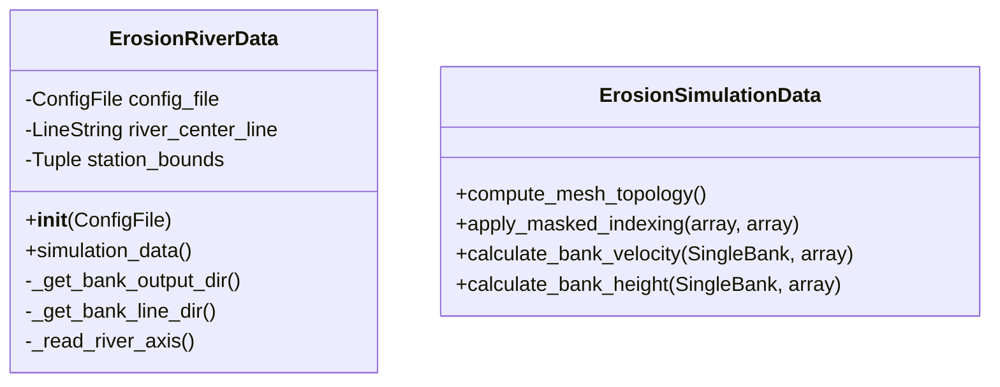

# Bank Erosion Input Data Models

The Bank Erosion Input Data Models module provides data structures for representing input data in the D-FAST Bank Erosion software.

## Overview

The Bank Erosion Input Data Models module contains classes that represent various aspects of bank erosion input data, such as river data and simulation data. These data models are used by the Bank Erosion module to process and analyze bank erosion.



## Components

The Bank Erosion Input Data Models module consists of the following components:

### Data Models

::: dfastbe.bank_erosion.data_models.inputs

The data models component provides classes for representing various types of input data related to bank erosion, such as:

- **ErosionSimulationData**: Represents simulation data for erosion calculations, including mesh topology, bank velocity, and bank height
- **ErosionRiverData**: Represents river data for erosion calculations, including river center line, bank lines, and simulation data
- **BankLinesResultsError**: An exception class for bank lines results errors

## Usage Example

```python
from dfastbe.bank_erosion.data_models.inputs import ErosionRiverData, ErosionSimulationData
from dfastbe.io.config import ConfigFile

# Load configuration file
config_file = ConfigFile.read("config.cfg")

# Create river data object
river_data = ErosionRiverData(config_file)

# Access river data properties
print(f"River center line: {river_data.river_center_line}")
print(f"Bank lines: {river_data.bank_lines}")

# Get simulation data
simulation_data = river_data.simulation_data()

# Compute mesh topology
mesh_data = simulation_data.compute_mesh_topology()
```

For more details on the specific classes and their properties, refer to the API reference below.