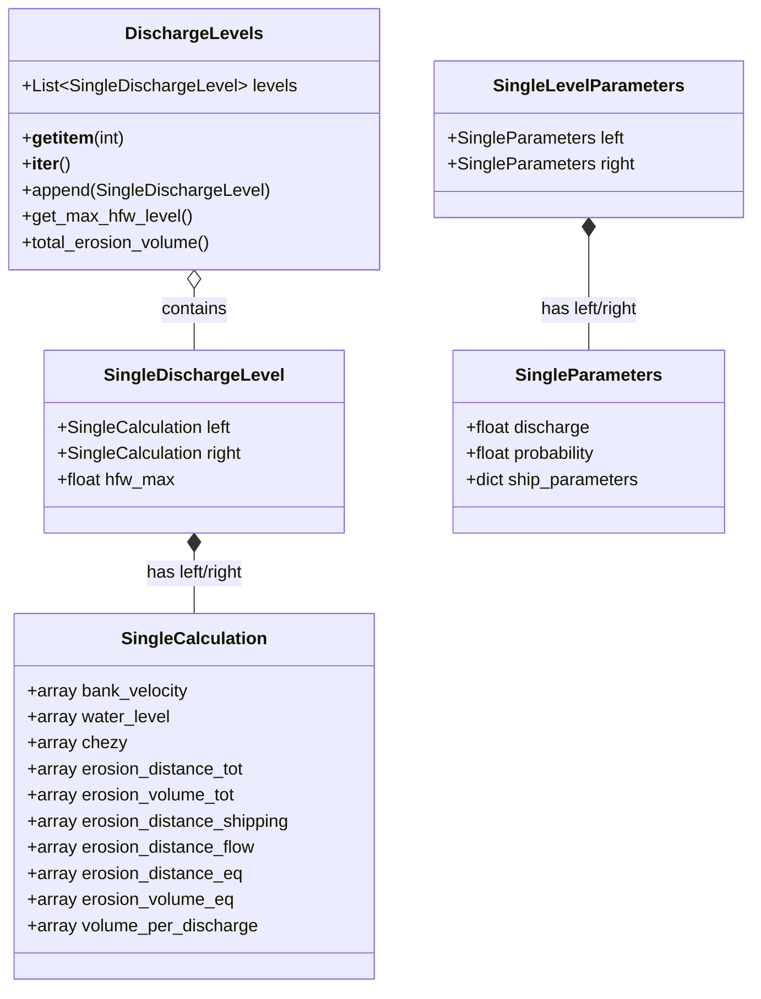
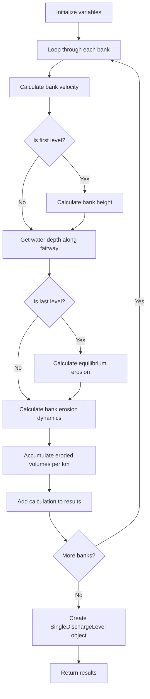
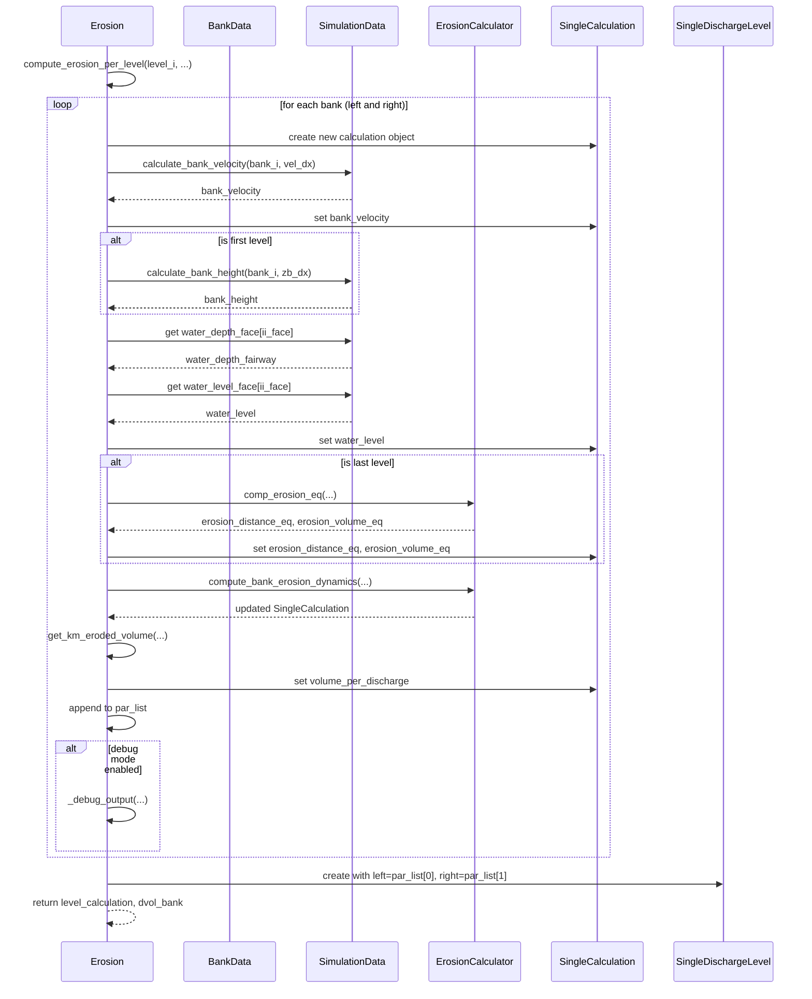
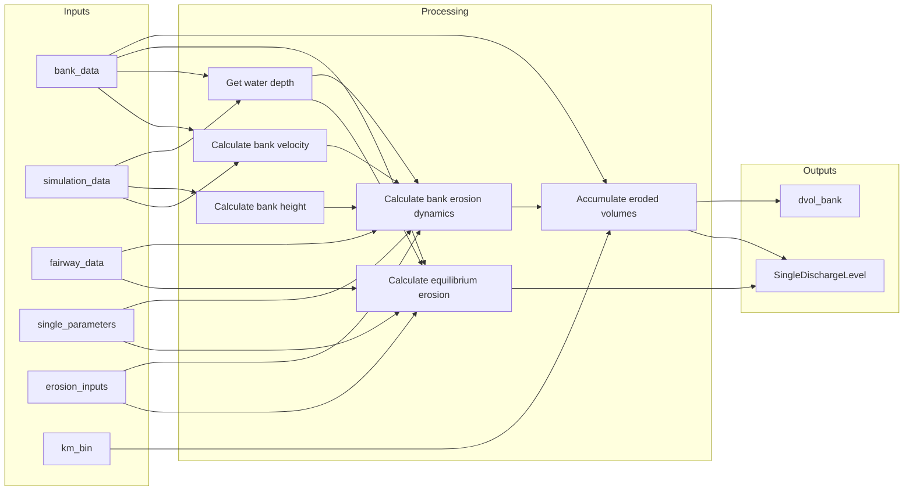
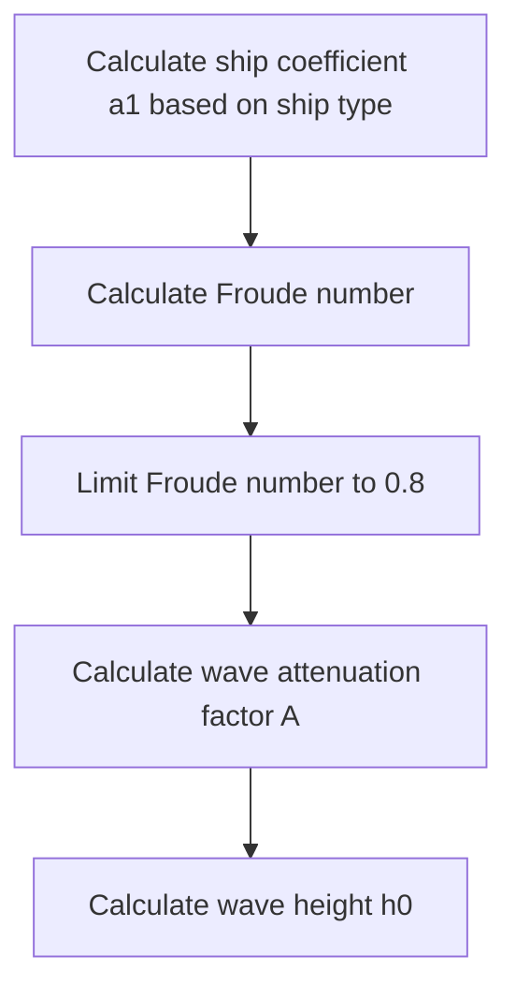
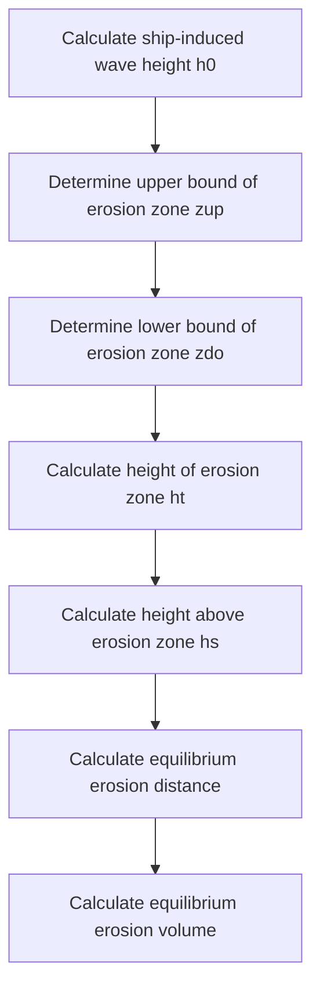
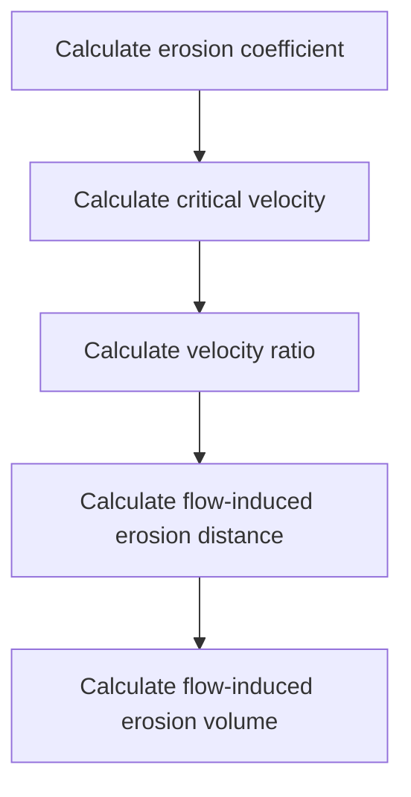
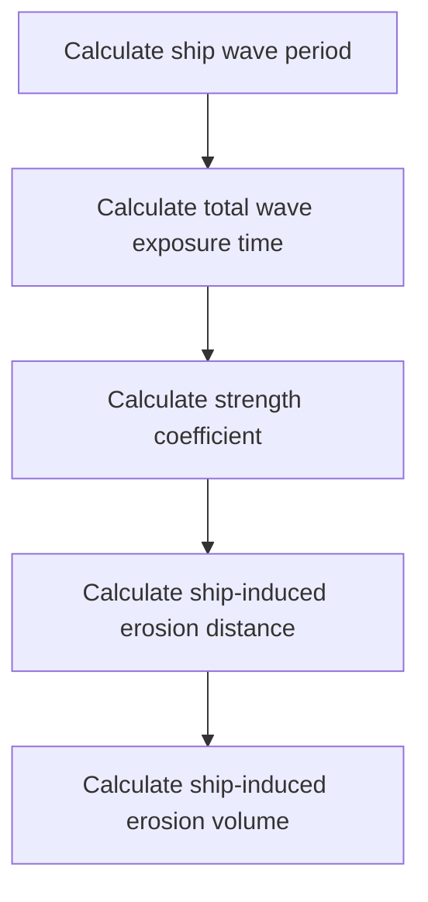

# Erosion Calculation Process

This document explains the bank erosion calculation process in the D-FAST Bank Erosion software, focusing on the `compute_erosion_per_level` method in the `Erosion` class.

## Overview

The `compute_erosion_per_level` method is a core component of the bank erosion calculation process. It calculates the bank erosion for a specific discharge level, processing both the left and right banks of the river. The method computes various parameters such as bank velocity, water depth, and erosion distances, and returns a `SingleDischargeLevel` object containing the results for both banks.

## Data Model

Before diving into the calculation process, it's important to understand the data model used in the bank erosion calculations:



The `DischargeLevels` class contains a list of `SingleDischargeLevel` objects, each representing the erosion calculation results for a specific discharge level. Each `SingleDischargeLevel` has left and right attributes of type `SingleCalculation`, which store the calculation results for the left and right banks, respectively.

## Calculation Process

The `compute_erosion_per_level` method follows these steps:



### Detailed Steps

1. **Initialize variables**:
   - Create an array to store eroded volumes per kilometer
   - Initialize the maximum water depth to 0
   - Create an empty list to store calculation results for each bank

2. **Loop through each bank** (left and right):
   - Create a new `SingleCalculation` object to store results

3. **Calculate bank velocity**:
   - Compute the velocity along the bank using the simulation data

4. **Calculate bank height** (only for the first level):
   - Determine the maximum bed elevation per cell along the bank

5. **Get water depth along the fairway**:
   - Extract water depth values from the simulation data
   - Update the maximum water depth if necessary

6. **Calculate equilibrium erosion** (only for the last level):
   - Compute the equilibrium erosion distance and volume using the `ErosionCalculator`
   - Store the results in the `SingleCalculation` object

7. **Calculate bank erosion dynamics**:
   - Compute the bank erosion during the current discharge level using the `ErosionCalculator`
   - This includes calculating erosion due to both flow and shipping

8. **Accumulate eroded volumes per kilometer**:
   - Aggregate the eroded volumes by kilometer bins
   - Store the results in the `SingleCalculation` object
   - Add the volumes to the total eroded volumes array

9. **Output debug information** (if debug mode is enabled):
   - Write detailed information about the calculations to files

10. **Create a SingleDischargeLevel object**:
    - Combine the calculation results for both banks into a single object
    - Include the maximum water depth in the fairway

11. **Return results**:
    - Return the `SingleDischargeLevel` object and the eroded volumes array

## Sequence Diagram

The following sequence diagram illustrates the interaction between different components during the execution of the `compute_erosion_per_level` method:



## Data Flow

The data flow in the `compute_erosion_per_level` method can be visualized as follows:



## Key Calculations

The `compute_erosion_per_level` method relies on two key calculations performed by the `ErosionCalculator`:

1. **Equilibrium Erosion Calculation** (for the last discharge level):
   - Calculates the equilibrium bank erosion distance and volume
   - Takes into account bank height, water level, and ship-induced wave height
   - Returns the maximum potential erosion distance and volume

2. **Bank Erosion Dynamics Calculation** (for all discharge levels):
   - Calculates the bank erosion during a specific discharge level
   - Computes erosion due to both flow and shipping
   - Takes into account bank velocity, water level, and ship parameters
   - Returns the erosion distance and volume for the current level

## Physical Processes and Mathematical Models

The erosion calculation process is based on physical processes and mathematical models that describe the interaction between water flow, ship waves, and bank material. This section explains the key formulas and calculations used in the `ErosionCalculator` class.

### Ship-Induced Wave Height Calculation

The height of waves generated by passing ships is a key factor in bank erosion. The wave height at the bank is calculated using the following formula:



1. **Ship coefficient (a1)** depends on ship type:
   - Multiple barge convoy: `a1 = 0.5`
   - RHK ship / motor ship: `a1 = 0.28 * ship_draught^1.25`
   - Towboat: `a1 = 1`

2. **Froude number** is calculated as:
   ```
   froude = ship_velocity / √(h * g)
   ```
   where:
   - `ship_velocity` is the velocity of the ship [m/s]
   - `h` is the water depth at the fairway [m]
   - `g` is the gravitational acceleration [m/s²]

   The Froude number is limited to 0.8 to prevent unrealistic wave heights.

3. **Wave attenuation factor (A)** accounts for the reduction in wave height with distance from the fairway:
   ```
   A = 0.5 * (1 + cos((bank_fairway_dist - fairway_wave_disappear_distance) / (fairway_wave_reduction_distance - fairway_wave_disappear_distance) * π))
   ```
   with the following conditions:
   - If `bank_fairway_dist < fairway_wave_disappear_distance`, then `A = 1`
   - If `bank_fairway_dist > fairway_wave_reduction_distance`, then `A = 0`

4. **Wave height (h0)** is calculated as:
   ```
   h0 = a1 * h * (bank_fairway_dist / h)^(-1/3) * froude^4 * A
   ```

### Equilibrium Erosion Calculation

The equilibrium erosion represents the maximum potential erosion that could occur over a very long time period. It is calculated as follows:



1. **Upper bound of erosion zone (zup)**:
   ```
   zup = min(bank_height, water_level_fairway_ref + 2 * h0)
   ```

2. **Lower bound of erosion zone (zdo)**:
   ```
   zdo = max(water_level_fairway_ref - 2 * h0, bank_protection_level)
   ```

3. **Height of erosion zone (ht)**:
   ```
   ht = max(zup - zdo, 0)
   ```

4. **Height above erosion zone (hs)**:
   ```
   hs = max(bank_height - water_level_fairway_ref + 2 * h0, 0)
   ```

5. **Equilibrium erosion distance (eq_erosion_distance)**:
   ```
   eq_erosion_distance = ht / mu_slope
   ```
   where `mu_slope` is the bank slope [-]

6. **Equilibrium erosion volume (eq_erosion_volume)**:
   ```
   eq_erosion_volume = (0.5 * ht + hs) * eq_erosion_distance * segment_length
   ```

### Bank Erosion Dynamics Calculation

The bank erosion dynamics calculation determines the erosion that occurs during a specific discharge level, taking into account both flow-induced and ship-induced erosion.

#### Flow-Induced Erosion

Flow-induced erosion occurs when the flow velocity exceeds the critical velocity for the bank material:



1. **Erosion coefficient (erosion_coef)**:
   ```
   erosion_coef = 0.2 * √(tauc) * 10^-6
   ```
   where `tauc` is the critical shear stress [N/m²]

2. **Critical velocity (critical_velocity)**:
   ```
   critical_velocity = √(tauc / (water_density * chezy² / g))
   ```
   where:
   - `water_density` is the density of water [kg/m³]
   - `chezy` is the Chezy coefficient [m^0.5/s]
   - `g` is the gravitational acceleration [m/s²]

3. **Velocity ratio (crit_ratio)**:
   ```
   crit_ratio = (vel / critical_velocity)²
   ```
   if `vel > critical_velocity` and `water_level > bank_protection_level`

4. **Flow-induced erosion distance (erosion_distance_flow)**:
   ```
   erosion_distance_flow = erosion_coef * (crit_ratio - 1) * time_erosion * sec_year
   ```
   where:
   - `time_erosion` is the erosion period [yr]
   - `sec_year` is the number of seconds in a year (3600 * 24 * 365)

5. **Flow-induced erosion volume (dv_flow)**:
   ```
   dv_flow = erosion_distance_flow * segment_length * h_line_flow
   ```
   where `h_line_flow` is the height of the bank subject to flow erosion

#### Ship-Induced Erosion

Ship-induced erosion occurs due to waves generated by passing ships:



1. **Ship wave period (ship_wave_period)**:
   ```
   ship_wave_period = 0.51 * ship_velocity / g
   ```

2. **Total wave exposure time (ts)**:
   ```
   ts = ship_wave_period * num_ship * num_waves_per_ship
   ```
   where:
   - `num_ship` is the number of ships
   - `num_waves_per_ship` is the number of waves per ship

3. **Strength coefficient (cE)**:
   ```
   cE = 1.85 * 10^-4 / tauc
   ```

4. **Ship-induced erosion distance (erosion_distance_shipping)**:
   ```
   erosion_distance_shipping = cE * wave_height² * ts * time_erosion
   ```
   if `ship_wave_min < water_level_fairway_ref < ship_wave_max`

5. **Ship-induced erosion volume (dv_ship)**:
   ```
   dv_ship = erosion_distance_shipping * segment_length * h_line_ship
   ```
   where `h_line_ship` is the height of the bank subject to ship-induced erosion

#### Total Erosion

The total erosion is the sum of flow-induced and ship-induced erosion:

1. **Total erosion distance (erosion_distance)**:
   ```
   erosion_distance = erosion_distance_shipping + erosion_distance_flow
   ```

2. **Total erosion volume (erosion_volume)**:
   ```
   erosion_volume = dv_ship + dv_flow
   ```

## Usage Example

The `compute_erosion_per_level` method is called within the `_process_discharge_levels` method of the `Erosion` class, which processes all discharge levels:

```python
def _process_discharge_levels(self, ...):
    # ...
    for level_i in range(num_levels):
        # ...
        level_calculation, dvol_bank = self.compute_erosion_per_level(
            level_i,
            bank_data,
            simulation_data,
            fairway_data,
            single_parameters,
            erosion_inputs,
            km_bin,
            num_km,
            bank_height,
        )
        discharge_levels.append(level_calculation)
        # ...
```

The results are then used to calculate the total erosion volume and other parameters for the entire river.
