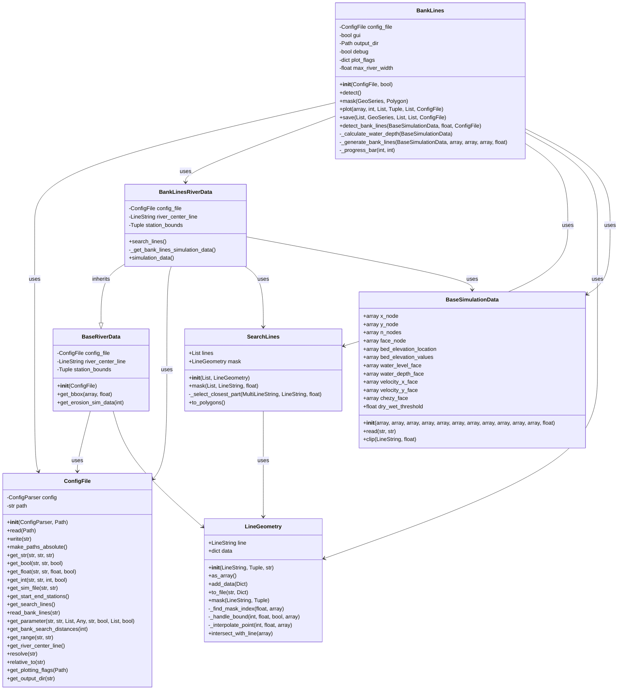

# Bank Lines Module

The Bank Lines module is responsible for detecting bank lines from hydrodynamic simulation results. It is one of the core components of the D-FAST Bank Erosion software.

## Overview

The Bank Lines module processes hydrodynamic simulation results to detect bank lines, which are the boundaries between wet and dry areas in the river. These bank lines are then used as input for bank erosion calculations. The module can detect bank lines for multiple simulations and combine them into a single set of bank lines.



## Components

The Bank Lines module consists of the following components:

### Main Classes

::: dfastbe.bank_lines.bank_lines

### Data Models

::: dfastbe.bank_lines.data_models

### Utility Functions

The Bank Lines module includes several utility functions for processing bank lines:

- **sort_connect_bank_lines**: Sorts and connects bank line fragments
- **poly_to_line**: Converts polygons to lines
- **tri_to_line**: Converts triangles to lines

## Workflow

The typical workflow for bank line detection is:

1. Initialize the BankLines object with a configuration file
2. Call the `detect` method to start the bank line detection process
3. The `detect` method orchestrates the entire process:
   - Loads hydrodynamic simulation data
   - Calculates water depth
   - Generates bank lines
   - Masks bank lines with bank areas
   - Saves bank lines to output files
   - Generates plots

## Usage Example

```python
from dfastbe.io.config import ConfigFile
from dfastbe.bank_lines.bank_lines import BankLines

# Load configuration file
config_file = ConfigFile.read("config.cfg")

# Initialize BankLines object
bank_lines = BankLines(config_file)

# Run bank line detection
bank_lines.detect()
```

For more details on the specific methods and classes, refer to the API reference below.
