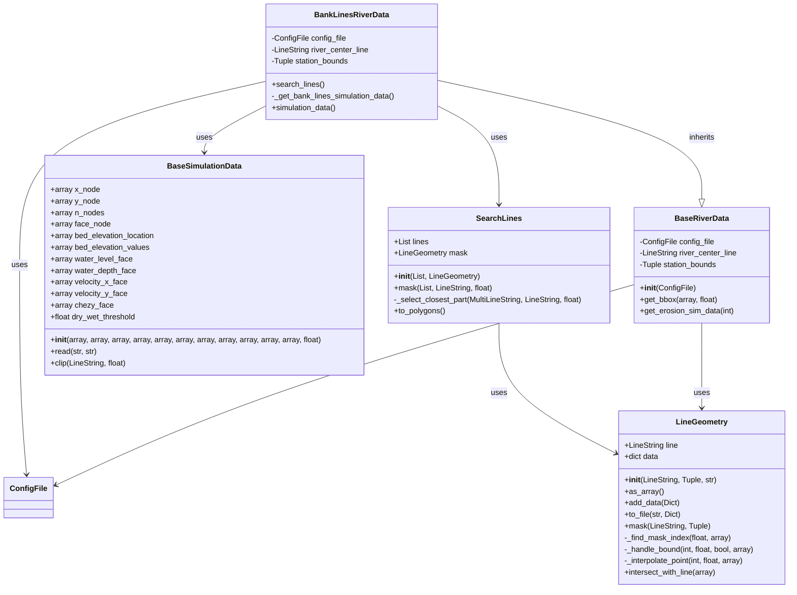

# Bank Lines Data Models

The Bank Lines Data Models module provides data structures for representing bank lines and related data in the D-FAST Bank Erosion software.

## Overview

The Bank Lines Data Models module contains classes that represent various aspects of bank lines, such as river data, simulation data, and bank line geometry. These data models are used by the Bank Lines module to process and analyze bank lines.



## Components

The Bank Lines Data Models module consists of the following components:

### Data Models

::: dfastbe.bank_lines.data_models

The data models component provides classes for representing various types of data related to bank lines, such as:

- **BankLinesRiverData**: Represents river data for bank line detection
- **BankLineGeometry**: Represents the geometry of a bank line
- **BankLineProperties**: Represents properties of a bank line

## Usage Example

```python
from dfastbe.bank_lines.data_models import BankLinesRiverData
from dfastbe.io.config import ConfigFile

# Load configuration file
config_file = ConfigFile.read("config.cfg")

# Create river data object
river_data = BankLinesRiverData(config_file)

# Access river data properties
print(f"River name: {river_data.name}")
print(f"River length: {river_data.length} km")
```

For more details on the specific classes and their properties, refer to the API reference below.
