# Class Diagram for Existing D-FAST Bank Erosion Code

## Overview

This document provides a class diagram and detailed description of the current architecture of the D-FAST Bank Erosion software. The diagram illustrates the relationships between classes, key methods, and data flow across all modules.

## Class Diagram

```mermaid
classDiagram
    %% Main Classes

    %% Generic Base Class
    class BaseBank~T~ {
        +T left
        +T right
        +get_bank(int)
        +from_column_arrays(Dict, Type, Tuple)
    }
    class Erosion {
        -ErosionCalculator erosion_calculator
        +__init__(ConfigFile, bool)
        +run()
    }

    class ErosionCalculator {
    }

    class BankLines {
        -ConfigFile config_file
        +__init__(ConfigFile, bool)
        +detect()
        +mask(GeoSeries, Polygon)
        +plot()
        +save()
        +detect_bank_lines()
    }

    class ConfigFile {
    }

    %% Data Models - Bank Erosion
    class ErosionRiverData {
    }

    class ErosionSimulationData {
    }

    class BankData {
    }

    class SingleBank {
    }

    class FairwayData {
    }

    class ErosionInputs {
    }

    class SingleErosion {
    }

    class ErosionResults {
    }

    class WaterLevelData {
        +List water_levels
        +array hfw_max
    }

    class MeshData {
    }

    class DischargeLevels {
    }

    class SingleDischargeLevel {
    }

    class SingleCalculation {
    }

    class SingleLevelParameters {
        +List banks
    }

    class SingleParameters {
    }

    %% Data Models - Bank Lines
    class BankLinesRiverData {
    }

    class SearchLines {
    }

    %% Data Models - IO
    class LineGeometry {
    }

    class BaseSimulationData {
    }

    class BaseRiverData {
    }

    %% Relationships
    Erosion --> ConfigFile : uses
    Erosion --> ErosionRiverData : uses
    Erosion --> ErosionSimulationData : uses
    Erosion --> BankData : uses
    Erosion --> FairwayData : uses
    Erosion --> ErosionInputs : uses
    Erosion --> ErosionResults : uses
    Erosion --> DischargeLevels : uses
    Erosion --> WaterLevelData : uses
    Erosion --> MeshData : uses
    Erosion --> SingleCalculation : uses
    Erosion --> SingleLevelParameters : uses
    Erosion --> SingleDischargeLevel : uses
    Erosion --> SingleParameters : uses
    Erosion --> SingleErosion : uses
    Erosion --> Debugger : uses
    Erosion --> BankLinesProcessor : uses
    Erosion --> LineGeometry : uses
    Erosion --> ErosionCalculator : uses

    BankLines --> ConfigFile : uses
    BankLines --> BankLinesRiverData : uses
    BankLines --> SearchLines : uses
    BankLines --> LineGeometry : uses
    BankLines --> BaseSimulationData : uses

    SearchLines --> LineGeometry : uses

    ErosionRiverData --|> BaseRiverData : inherits
    ErosionRiverData --> ConfigFile : uses

    BankLinesRiverData --|> BaseRiverData : inherits
    BankLinesRiverData --> ConfigFile : uses
    BankLinesRiverData --> SearchLines : uses
    BankLinesRiverData --> BaseSimulationData : uses

    ErosionSimulationData --|> BaseSimulationData : inherits
    ErosionSimulationData --> MeshData : uses
    ErosionSimulationData --> SingleBank : uses

    %% Inheritance relationships
    BankData --|> BaseBank : inherits
    BankData --|> BaseBank : inherits
    ErosionInputs --|> BaseBank : inherits
    SingleDischargeLevel --|> BaseBank : inherits
    SingleLevelParameters --|> BaseBank : inherits

    %% Containment relationships
    BankData --> SingleBank : contains
    ErosionInputs --> SingleErosion : contains
    SingleDischargeLevel --> SingleCalculation : contains
    SingleLevelParameters --> SingleParameters : contains
    DischargeLevels --> SingleDischargeLevel : contains

    BaseRiverData --> ConfigFile : uses
    BaseRiverData --> LineGeometry : uses
```

for detailed class diagram [Detailed class diagram](detailed-class-diagram.md)
## Class Descriptions

### Main Classes

#### Erosion
- **Responsibility**: Handles the calculation of bank erosion based on hydrodynamic data and detected bank lines
- **Key Methods**:
  - `run()`: Executes the complete erosion analysis workflow
  - `compute_erosion_per_level()`: Computes erosion for a specific discharge level
  - `calculate_fairway_bank_line_distance()`: Calculates the distance between bank lines and fairway
- **Dependencies**: ConfigFile, ErosionRiverData, BankData, FairwayData, ErosionInputs, ErosionResults, DischargeLevels, WaterLevelData, MeshData

#### BankLines
- **Responsibility**: Handles the detection of bank lines from hydrodynamic simulation results
- **Key Methods**:
  - `detect()`: Executes the bank line detection workflow
  - `detect_bank_lines()`: Detects bank lines from simulation data
  - `mask()`: Masks bank lines with bank areas
  - `save()`: Saves bank lines to output files
- **Dependencies**: ConfigFile, BankLinesRiverData, SearchLines

#### ConfigFile
- **Responsibility**: Handles configuration file parsing and management
- **Key Methods**:
  - `read()`: Reads a configuration file
  - `write()`: Writes a configuration file
  - `get_parameter()`: Gets a parameter from the configuration
  - `get_river_center_line()`: Gets the river center line from the configuration
- **Dependencies**: None

### Data Models - Bank Erosion

#### BaseBank
- **Responsibility**: Generic base class for representing paired bank data (left and right banks)
- **Key Properties**:
  - `left`: Left bank data (generic type)
  - `right`: Right bank data (generic type)
  - `id`: Optional identifier
- **Key Methods**:
  - `get_bank()`: Gets bank data for a specific bank index (0 for left, 1 for right)
  - `from_column_arrays()`: Creates a BaseBank instance from column arrays
  - `__iter__()`: Allows iteration over banks
- **Dependencies**: None

#### ErosionRiverData
- **Responsibility**: Represents river data for erosion calculations
- **Key Methods**:
  - `simulation_data()`: Gets simulation data for erosion calculations
- **Dependencies**: BaseRiverData, ConfigFile

#### ErosionSimulationData
- **Responsibility**: Represents simulation data for erosion calculations
- **Key Methods**:
  - `compute_mesh_topology()`: Computes mesh topology
  - `calculate_bank_velocity()`: Calculates velocity at bank
  - `calculate_bank_height()`: Calculates height at bank
- **Dependencies**: BaseSimulationData, SingleBank

#### BankData
- **Responsibility**: Represents bank data for erosion calculations
- **Key Properties**:
  - `left`: Left bank (SingleBank)
  - `right`: Right bank (SingleBank)
  - `id`: Optional identifier
- **Inheritance**: Inherits from BaseBank[SingleBank]
- **Dependencies**: BaseBank, SingleBank

#### SingleBank
- **Responsibility**: Represents a single bank for erosion calculations
- **Key Properties**:
  - `bank_line`: Bank line geometry
  - `face_indices`: Indices of faces adjacent to the bank
  - `chainage`: Chainage along the bank
  - `is_right`: Whether the bank is a right bank
- **Dependencies**: None

#### FairwayData
- **Responsibility**: Represents fairway data for erosion calculations
- **Key Properties**:
  - `fairway_axis`: Fairway axis geometry
  - `fairway_polygon`: Fairway polygon geometry
  - `fairway_initial_water_levels`: Initial water levels in the fairway
  - `fairway_velocities`: Velocities in the fairway
  - `fairway_chezy_coefficients`: Chezy coefficients in the fairway
- **Dependencies**: None

#### ErosionInputs
- **Responsibility**: Represents inputs for erosion calculations
- **Key Properties**:
  - `left`: Left bank erosion inputs (SingleErosion)
  - `right`: Right bank erosion inputs (SingleErosion)
  - `id`: Optional identifier
  - `shipping_data`: Shipping data for erosion calculations
- **Inheritance**: Inherits from BaseBank[SingleErosion]
- **Dependencies**: BaseBank, SingleErosion

#### SingleErosion
- **Responsibility**: Represents erosion inputs for a single bank
- **Key Properties**:
  - `wave_fairway_distance_0`: Distance from fairway for wave calculations
  - `wave_fairway_distance_1`: Distance from fairway for wave calculations
  - `bank_protection_level`: Bank protection level
  - `tauc`: Critical shear stress
  - `bank_type`: Bank type
- **Dependencies**: None

#### ErosionResults
- **Responsibility**: Represents results of erosion calculations
- **Key Properties**:
  - Various lists and arrays storing erosion-related data
- **Dependencies**: None

#### Debugger
- **Responsibility**: Handles debugging and output of bank erosion calculations
- **Key Methods**:
  - `last_discharge_level()`: Writes the last discharge level to a shapefile and CSV file
  - `middle_levels()`: Writes the middle levels to a shapefile and CSV file
  - `_write_data()`: Writes data to a shapefile and CSV file
- **Dependencies**: None

#### BankLinesProcessor
- **Responsibility**: Processes bank lines and intersects them with a mesh
- **Key Methods**:
  - `intersect_with_mesh()`: Intersects bank lines with a mesh and returns bank data
- **Dependencies**: ErosionRiverData, LineGeometry

#### ErosionCalculator
- **Responsibility**: Performs erosion calculations for bank erosion
- **Key Methods**:
  - `comp_erosion_eq()`: Computes the equilibrium bank erosion distance and volume
  - `compute_bank_erosion_dynamics()`: Computes the bank erosion during a specific discharge level
  - `comp_hw_ship_at_bank()`: Computes wave heights at bank due to passing ships
- **Dependencies**: None

#### WaterLevelData
- **Responsibility**: Represents water level data for erosion calculations
- **Key Properties**:
  - `water_levels`: List of water levels
  - `hfw_max`: Maximum water level
- **Dependencies**: None

#### MeshData
- **Responsibility**: Represents mesh data for erosion calculations
- **Key Properties**:
  - Various arrays storing mesh-related data
- **Dependencies**: None

#### DischargeLevels
- **Responsibility**: Represents discharge levels for erosion calculations
- **Key Properties**:
  - `levels`: List of SingleDischargeLevel objects
- **Dependencies**: SingleDischargeLevel

#### SingleDischargeLevel
- **Responsibility**: Represents a calculation level for erosion calculations
- **Key Properties**:
  - `left`: Left bank calculation parameters (SingleCalculation)
  - `right`: Right bank calculation parameters (SingleCalculation)
  - `id`: Optional identifier
- **Inheritance**: Inherits from BaseBank[SingleCalculation]
- **Dependencies**: BaseBank, SingleCalculation

#### SingleCalculation
- **Responsibility**: Represents parameters for discharge calculations
- **Key Properties**:
  - Various arrays storing discharge-related data
- **Dependencies**: None

#### SingleLevelParameters
- **Responsibility**: Represents parameters for discharge levels
- **Key Properties**:
  - `left`: Left bank parameters (SingleParameters)
  - `right`: Right bank parameters (SingleParameters)
  - `id`: Optional identifier
- **Inheritance**: Inherits from BaseBank[SingleParameters]
- **Dependencies**: BaseBank, SingleParameters

#### SingleParameters
- **Responsibility**: Represents parameters for each bank
- **Key Properties**:
  - `discharge`: Discharge value
  - `probability`: Probability of discharge
  - `ship_parameters`: Ship parameters
- **Dependencies**: None

### Data Models - Bank Lines

#### BankLinesRiverData
- **Responsibility**: Represents river data for bank line detection
- **Key Methods**:
  - `search_lines()`: Gets search lines for bank line detection
  - `simulation_data()`: Gets simulation data for bank line detection
- **Dependencies**: BaseRiverData, ConfigFile, SearchLines

#### SearchLines
- **Responsibility**: Represents search lines for bank line detection
- **Key Methods**:
  - `mask()`: Masks search lines with river center line
  - `to_polygons()`: Converts search lines to polygons
- **Dependencies**: LineGeometry

### Data Models - IO

#### LineGeometry
- **Responsibility**: Represents line geometry
- **Key Methods**:
  - `mask()`: Masks line geometry
  - `intersect_with_line()`: Intersects line geometry with another line
- **Dependencies**: None

#### BaseSimulationData
- **Responsibility**: Base class for simulation data
- **Key Methods**:
  - `read()`: Reads simulation data from a file
  - `clip()`: Clips simulation data to a region
- **Dependencies**: None

#### BaseRiverData
- **Responsibility**: Base class for river data
- **Key Methods**:
  - `get_erosion_sim_data()`: Gets simulation data for erosion calculations
- **Dependencies**: ConfigFile, LineGeometry

## Data Flow

1. The user initializes the `Erosion` or `BankLines` class with a `ConfigFile`
2. The `ConfigFile` is used to read configuration parameters
3. For bank line detection:
   - `BankLines` uses `BankLinesRiverData` to get river data
   - `BankLinesRiverData` uses `SearchLines` to get search lines
   - `BankLines` detects bank lines and saves them to output files
4. For erosion calculation:
   - `Erosion` uses `ErosionRiverData` to get river data
   - `Erosion` processes the river axis and gets fairway data
   - `Erosion` prepares initial conditions and processes discharge levels
   - `Erosion` computes erosion per level and post-processes results
   - `Erosion` writes output files and generates plots

This architecture provides a clear separation of concerns, with each class having a specific responsibility. The data flows through the system in a logical manner, with each step building on the previous one.
