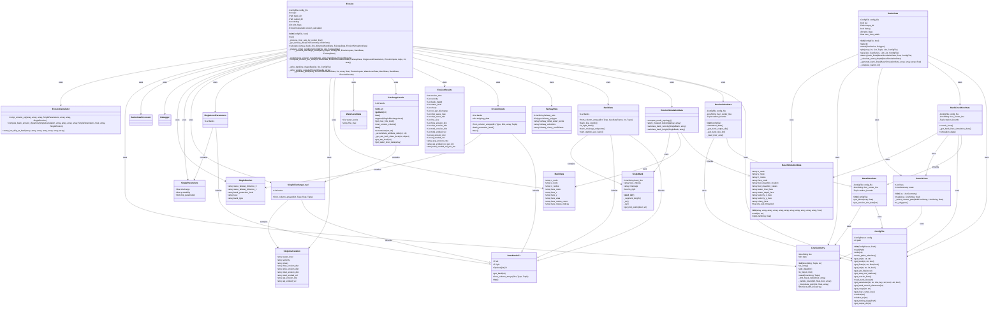

```mermaid
classDiagram
    %% Main Classes

    %% Generic Base Class
    class BaseBank~T~ {
        +T left
        +T right
        +Optional[int] id
        +get_bank(int)
        +from_column_arrays(Dict, Type, Tuple)
        +__iter__()
    }
    class Erosion {
        -ConfigFile config_file
        -bool gui
        -Path bank_dir
        -Path output_dir
        -bool debug
        -dict plot_flags
        -ErosionCalculator erosion_calculator
        +__init__(ConfigFile, bool)
        +run()
        -_process_river_axis_by_center_line()
        -_get_fairway_data(LineGeometry, MeshData)
        +calculate_fairway_bank_line_distance(BankData, FairwayData, ErosionSimulationData)
        -_prepare_initial_conditions(ConfigFile, List, FairwayData)
        -_process_discharge_levels(array, tuple, ConfigFile, ErosionInputs, BankData, FairwayData)
        -_postprocess_erosion_results(tuple, array, BankData, ErosionResults)
        +compute_erosion_per_level(int, BankData, ErosionSimulationData, FairwayData, SingleLevelParameters, ErosionInputs, tuple, int, array)
        -_write_bankline_shapefiles(list, list, ConfigFile)
        -_write_volume_outputs(ErosionResults, array)
        -_generate_plots(array, ErosionSimulationData, list, array, float, ErosionInputs, WaterLevelData, MeshData, BankData, ErosionResults)
    }

    class ErosionCalculator {
        +comp_erosion_eq(array, array, array, SingleParameters, array, array, SingleErosion)
        +compute_bank_erosion_dynamics(SingleCalculation, array, array, array, array, SingleParameters, float, array, SingleErosion)
        +comp_hw_ship_at_bank(array, array, array, array, array, array, array)
    }

    class BankLines {
        -ConfigFile config_file
        -bool gui
        -Path output_dir
        -bool debug
        -dict plot_flags
        -float max_river_width
        +__init__(ConfigFile, bool)
        +detect()
        +mask(GeoSeries, Polygon)
        +plot(array, int, List, Tuple, List, ConfigFile)
        +save(List, GeoSeries, List, List, ConfigFile)
        +detect_bank_lines(BaseSimulationData, float, ConfigFile)
        -_calculate_water_depth(BaseSimulationData)
        -_generate_bank_lines(BaseSimulationData, array, array, array, float)
        -_progress_bar(int, int)
    }

    class ConfigFile {
        -ConfigParser config
        -str path
        +__init__(ConfigParser, Path)
        +read(Path)
        +write(str)
        +make_paths_absolute()
        +get_str(str, str, str)
        +get_bool(str, str, bool)
        +get_float(str, str, float, bool)
        +get_int(str, str, int, bool)
        +get_sim_file(str, str)
        +get_start_end_stations()
        +get_search_lines()
        +read_bank_lines(str)
        +get_parameter(str, str, List, Any, str, bool, List, bool)
        +get_bank_search_distances(int)
        +get_range(str, str)
        +get_river_center_line()
        +resolve(str)
        +relative_to(str)
        +get_plotting_flags(Path)
        +get_output_dir(str)
    }

    %% Data Models - Bank Erosion
    class ErosionRiverData {
        -ConfigFile config_file
        -LineString river_center_line
        -Tuple station_bounds
        +__init__(ConfigFile)
        +simulation_data()
        -_get_bank_output_dir()
        -_get_bank_line_dir()
        -_read_river_axis()
    }

    class ErosionSimulationData {
        +compute_mesh_topology()
        +apply_masked_indexing(array, array)
        +calculate_bank_velocity(SingleBank, array)
        +calculate_bank_height(SingleBank, array)
    }

    class BankData {
        +List banks
        +from_column_arrays(dict, Type, GeoDataFrame, int, Tuple)
        +bank_line_coords()
        +is_right_bank()
        +bank_chainage_midpoints()
        +num_stations_per_bank()
    }

    class SingleBank {
        +LineString bank_line
        +array face_indices
        +array chainage
        +bool is_right
        +__post_init__()
        -_segment_length()
        -_dx()
        -_dy()
        +get_mid_points(bool, str)
    }

    class FairwayData {
        +LineString fairway_axis
        +Polygon fairway_polygon
        +array fairway_initial_water_levels
        +array fairway_velocities
        +array fairway_chezy_coefficients
    }

    class ErosionInputs {
        +List banks
        +dict shipping_data
        +from_column_arrays(dict, Type, Dict, array, Tuple)
        +bank_protection_level()
        +tauc()
    }

    class SingleErosion {
        +array wave_fairway_distance_0
        +array wave_fairway_distance_1
        +array bank_protection_level
        +array tauc
        +array bank_type
    }

    class ErosionResults {
        +int erosion_time
        +List velocity
        +List bank_height
        +List water_level
        +List chezy
        +List vol_per_discharge
        +List ship_wave_max
        +List ship_wave_min
        +List line_size
        +List flow_erosion_dist
        +List ship_erosion_dist
        +List total_erosion_dist
        +List total_eroded_vol
        +List eq_erosion_dist
        +List eq_eroded_vol
        +array avg_erosion_rate
        +array eq_eroded_vol_per_km
        +array total_eroded_vol_per_km
    }

    class WaterLevelData {
        +List water_levels
        +array hfw_max
    }

    class MeshData {
        +array x_node
        +array y_node
        +array n_nodes
        +array face_node
        +array face_x
        +array face_y
        +array face_area
        +array face_nodes_count
        +array face_nodes_indices
    }

    class DischargeLevels {
        +List levels
        +__init__(List)
        +__getitem__(int)
        +__len__()
        +append(SingleDischargeLevel)
        +get_max_hfw_level()
        +total_erosion_volume()
        +__iter__()
        +accumulate(str, str)
        -_accumulate_attribute_side(str, str)
        -_get_attr_both_sides_level(str, object)
        +get_attr_level(str)
        +get_water_level_data(array)
    }

    class SingleDischargeLevel {
        +List banks
        +from_column_arrays(dict, Type, float, Tuple)
    }

    class SingleCalculation {
        +array water_level
        +array velocity
        +array chezy
        +array flow_erosion_dist
        +array ship_erosion_dist
        +array total_erosion_dist
        +array total_eroded_vol
        +array eq_erosion_dist
        +array eq_eroded_vol
    }

    class SingleLevelParameters {
        +List banks
    }

    class SingleParameters {
        +float discharge
        +float probability
        +dict ship_parameters
    }

    %% Data Models - Bank Lines
    class BankLinesRiverData {
        -ConfigFile config_file
        -LineString river_center_line
        -Tuple station_bounds
        +search_lines()
        -_get_bank_lines_simulation_data()
        +simulation_data()
    }

    class SearchLines {
        +List lines
        +LineGeometry mask
        +__init__(List, LineGeometry)
        +mask(List, LineString, float)
        -_select_closest_part(MultiLineString, LineString, float)
        +to_polygons()
    }

    %% Data Models - IO
    class LineGeometry {
        +LineString line
        +dict data
        +__init__(LineString, Tuple, str)
        +as_array()
        +add_data(Dict)
        +to_file(str, Dict)
        +mask(LineString, Tuple)
        -_find_mask_index(float, array)
        -_handle_bound(int, float, bool, array)
        -_interpolate_point(int, float, array)
        +intersect_with_line(array)
    }

    class BaseSimulationData {
        +array x_node
        +array y_node
        +array n_nodes
        +array face_node
        +array bed_elevation_location
        +array bed_elevation_values
        +array water_level_face
        +array water_depth_face
        +array velocity_x_face
        +array velocity_y_face
        +array chezy_face
        +float dry_wet_threshold
        +__init__(array, array, array, array, array, array, array, array, array, array, array, float)
        +read(str, str)
        +clip(LineString, float)
    }

    class BaseRiverData {
        -ConfigFile config_file
        -LineString river_center_line
        -Tuple station_bounds
        +__init__(ConfigFile)
        +get_bbox(array, float)
        +get_erosion_sim_data(int)
    }

    %% Relationships
    Erosion --> ConfigFile : uses
    Erosion --> ErosionRiverData : uses
    Erosion --> ErosionSimulationData : uses
    Erosion --> BankData : uses
    Erosion --> FairwayData : uses
    Erosion --> ErosionInputs : uses
    Erosion --> ErosionResults : uses
    Erosion --> DischargeLevels : uses
    Erosion --> WaterLevelData : uses
    Erosion --> MeshData : uses
    Erosion --> SingleCalculation : uses
    Erosion --> SingleLevelParameters : uses
    Erosion --> SingleDischargeLevel : uses
    Erosion --> SingleParameters : uses
    Erosion --> SingleErosion : uses
    Erosion --> Debugger : uses
    Erosion --> BankLinesProcessor : uses
    Erosion --> LineGeometry : uses
    Erosion --> ErosionCalculator : uses

    BankLines --> ConfigFile : uses
    BankLines --> BankLinesRiverData : uses
    BankLines --> SearchLines : uses
    BankLines --> LineGeometry : uses
    BankLines --> BaseSimulationData : uses

    SearchLines --> LineGeometry : uses

    ErosionRiverData --|> BaseRiverData : inherits
    ErosionRiverData --> ConfigFile : uses

    BankLinesRiverData --|> BaseRiverData : inherits
    BankLinesRiverData --> ConfigFile : uses
    BankLinesRiverData --> SearchLines : uses
    BankLinesRiverData --> BaseSimulationData : uses

    ErosionSimulationData --|> BaseSimulationData : inherits
    ErosionSimulationData --> MeshData : uses
    ErosionSimulationData --> SingleBank : uses

    %% Inheritance relationships
    BankData --|> BaseBank : inherits
    BankData --|> BaseBank : inherits
    ErosionInputs --|> BaseBank : inherits
    SingleDischargeLevel --|> BaseBank : inherits
    SingleLevelParameters --|> BaseBank : inherits

    %% Containment relationships
    BankData --> SingleBank : contains
    ErosionInputs --> SingleErosion : contains
    SingleDischargeLevel --> SingleCalculation : contains
    SingleLevelParameters --> SingleParameters : contains
    DischargeLevels --> SingleDischargeLevel : contains

    BaseRiverData --> ConfigFile : uses
    BaseRiverData --> LineGeometry : uses
```