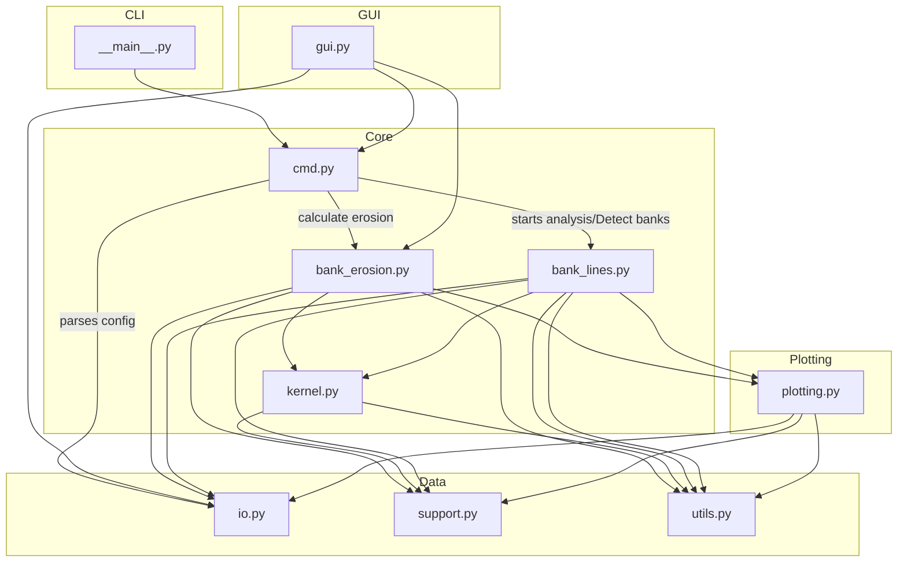
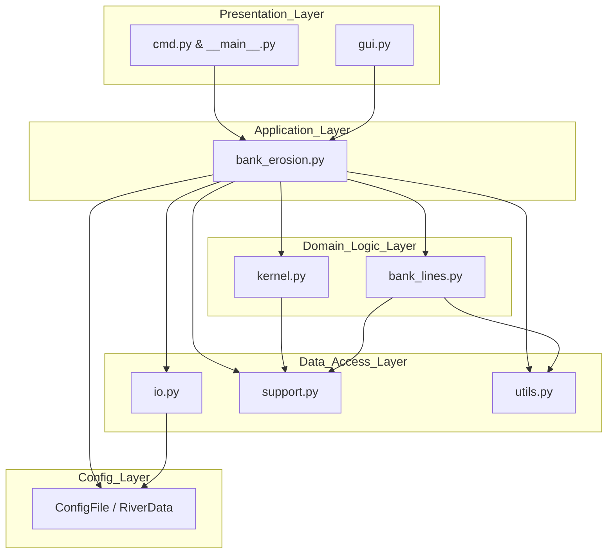

# D-FAST Bank Erosion Architecture and Design

## repository structure
```
D-FAST_Bank_Erosion/
├───.github
│   ├───ISSUE_TEMPLATE
│   └───workflows
├───docs
│   ├───end-user-docs
│   │   ├───chapters
│   │   ├───cover
│   │   └───figures
│   └───mkdocs
│       ├───api
│       ├───gui
│       └───guides
├───examples
│   └───data
├───src
│	└───dfastbe
│	    │   add.png
│	    │   bank_erosion.py
│	    │   bank_lines.py
│	    │   cmd.py
│	    │   D-FASTBE.png
│	    │   edit.png
│	    │   gui.py
│	    │   io.py
│	    │   io.py~
│	    │   kernel.py
│	    │   messages.NL.ini
│	    │   messages.UK.ini
│	    │   open.png
│	    │   plotting.py
│	    │   remove.png
│	    │   src.pyproj
│	    │   support.py
│	    │   utils.py
│	    │   __init__.py
│	    └───__main__.py
├───tests
├───tests-dist
├── README.md
├── pyproject.toml
└── license.md
```

## Workflow and how modules interact: 




