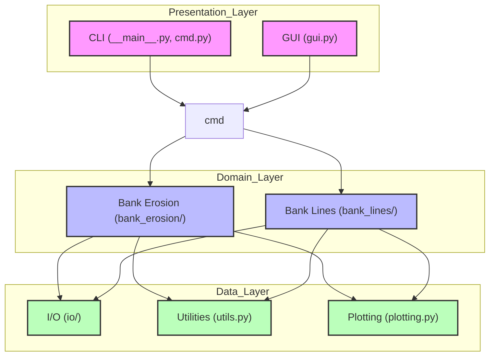
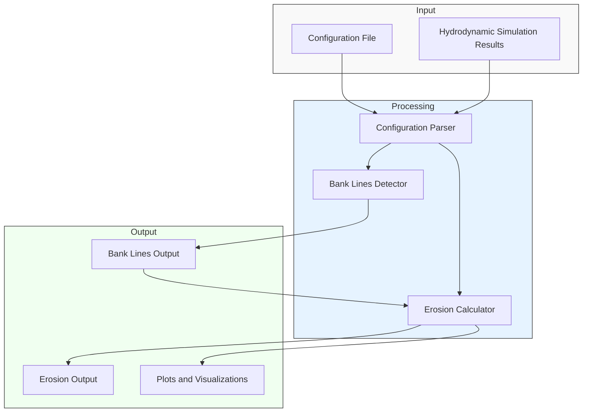
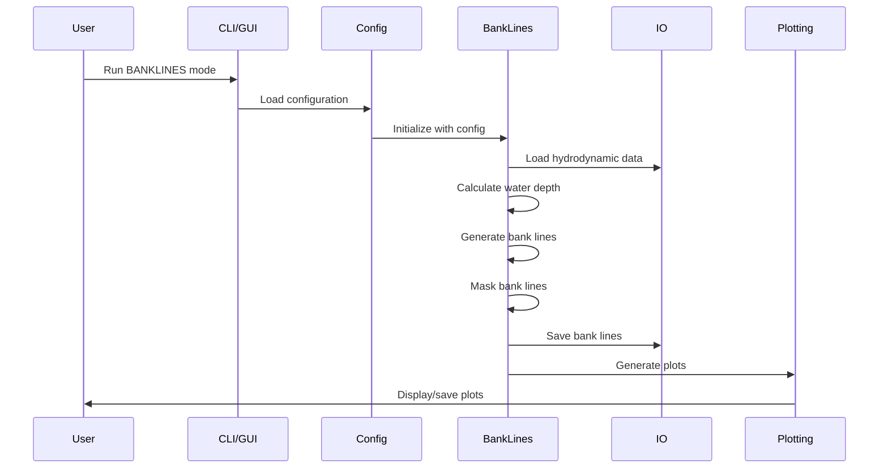
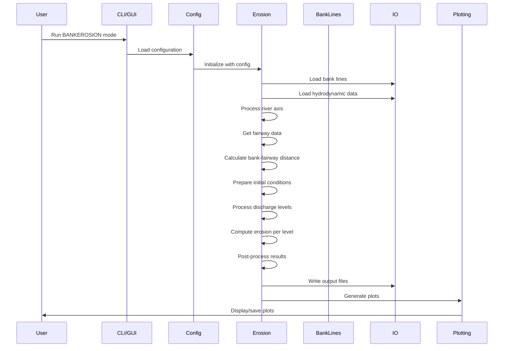

# D-FAST Bank Erosion Architecture and Design

This document provides a comprehensive overview of the D-FAST Bank Erosion software architecture, including its components, their relationships, and data flow.

## Overview

D-FAST Bank Erosion is a tool developed by Deltares to compute local bank erosion sensitivity and estimate the amount of bank material that will be eroded. It works in conjunction with D-Flow FM (Flexible Mesh) and requires users to run steady-state hydrodynamic simulations for different discharges.

The software has three main operational modes:
1. **BANKLINES**: Detects bank lines from hydrodynamic simulation results
2. **BANKEROSION**: Calculates bank erosion based on detected bank lines and hydrodynamic data
3. **GUI**: Provides a graphical user interface for configuring and running the above processes

## Repository Structure

```
D-FAST_Bank_Erosion/
├───docs                      # Documentation
│   ├───end-user-docs         # End-user documentation (LaTeX)
│   └───mkdocs                # MkDocs documentation (Markdown)
│       ├───api               # API reference documentation
│       ├───architecture-design # Architecture documentation
│       ├───gui               # GUI documentation
│       └───guides            # User and developer guides
├───examples                  # Example data and configurations
├───src                       # Source code
│   └───dfastbe               # Main package
│       ├───bank_erosion      # Bank erosion calculation modules
│       │   └───data_models   # Data models for bank erosion
│       ├───bank_lines        # Bank line detection modules
│       ├───gui               # GUI modules and resources
│       │   └───icons         # GUI icons
│       ├───io                # Input/output handling modules
│       │   └───log_data      # Logging data and resources
│       ├───__main__.py       # Entry point for CLI
│       ├───cmd.py            # Command processing
│       ├───plotting.py       # Plotting utilities
│       └───utils.py          # General utilities
├───tests                     # Test suite
└───pyproject.toml            # Project configuration
```

## Component Architecture

The D-FAST Bank Erosion software is organized into several key components, each with specific responsibilities:

### Core Components



1. **Presentation Layer**
   - **GUI**: Provides a graphical user interface for configuring and running bank line detection and erosion calculations
   - **CLI**: Provides a command-line interface for running the software in batch mode

2. **Domain Layer**
   - **Bank Erosion**: Handles the calculation of bank erosion based on hydrodynamic data and detected bank lines
   - **Bank Lines**: Handles the detection of bank lines from hydrodynamic simulation results

3. **Data Layer**
   - **I/O**: Handles input/output operations, including reading configuration files and writing results
   - **Utilities**: Provides general utility functions used across the application
   - **Plotting**: Handles the generation of plots and visualizations

## Module Details

### Bank Erosion Module

The Bank Erosion module (`bank_erosion/`) is responsible for calculating bank erosion based on hydrodynamic data and detected bank lines. It includes:

- **bank_erosion.py**: Main class for bank erosion calculations
- **erosion_calculator.py**: Encapsulates core erosion calculation algorithms
- **mesh_processor.py**: Processes mesh data from hydrodynamic simulations
- **debugger.py**: Provides debugging utilities
- **utils.py**: Utility functions specific to bank erosion
- **data_models/**: Data models for bank erosion inputs, calculations, and results

### Bank Lines Module

The Bank Lines module (`bank_lines/`) is responsible for detecting bank lines from hydrodynamic simulation results. It includes:

- **bank_lines.py**: Main class for bank line detection
- **data_models.py**: Data models for bank line detection
- **utils.py**: Utility functions specific to bank line detection

### I/O Module

The I/O module (`io/`) handles input/output operations, including:

- **config.py**: Handles configuration file parsing and management
- **data_models.py**: Data models for I/O operations
- **file_utils.py**: Utility functions for file operations
- **logger.py**: Handles logging functionality
- **log_data/**: Logging data and resources, including language files

### GUI Module

The GUI module (`gui/`) provides a graphical user interface for the application:

- **gui.py**: Main GUI implementation
- **icons/**: GUI icons and resources

## Data Flow

The following diagram illustrates the data flow through the D-FAST Bank Erosion software:



1. **Input**:
   - Configuration file specifying parameters for bank line detection and erosion calculation
   - Hydrodynamic simulation results from D-Flow FM

2. **Processing**:
   - Configuration parser reads and validates the configuration file
   - Bank lines detector processes hydrodynamic data to detect bank lines
   - Erosion calculator computes bank erosion based on detected bank lines and hydrodynamic data

3. **Output**:
   - Bank lines output (shapefiles)
   - Erosion output (shapefiles, CSV files)
   - Plots and visualizations

## Process Workflows

### Bank Line Detection Workflow



### Bank Erosion Calculation Workflow



## Configuration

The D-FAST Bank Erosion software is configured using a configuration file (typically with a .cfg extension). The configuration file specifies:

- Input and output directories
- Hydrodynamic simulation parameters
- Bank line detection parameters
- Erosion calculation parameters

The configuration file is parsed by the `ConfigFile` class in the `io.config` module.

## Extensibility

The modular architecture of D-FAST Bank Erosion allows for easy extension and modification:

- New hydrodynamic data formats can be supported by extending the I/O module
- Additional erosion calculation methods can be implemented in the Bank Erosion module
- New visualization types can be added to the Plotting module

## Conclusion

The D-FAST Bank Erosion software has a well-structured architecture that separates concerns into distinct modules. The modular design allows for easy maintenance, extension, and testing of the software.
