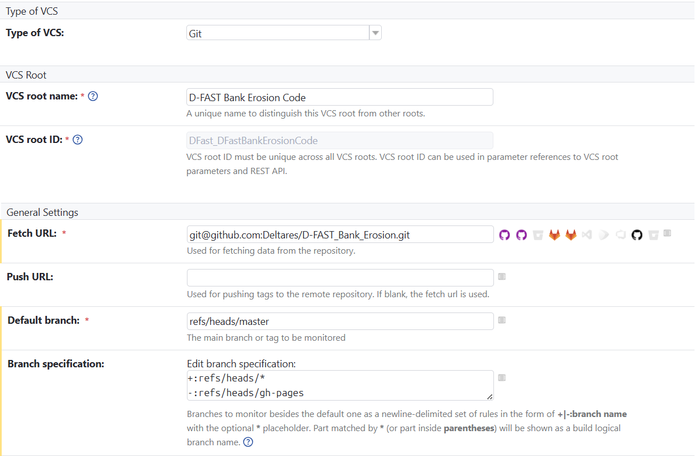

## Description of Files in the TeamCity pipelines

The `DFastBETests` folder contains Kotlin DSL configuration files for defining and managing TeamCity build configurations, templates, and dependencies for the D-FAST Bank Erosion project. Below is a description of each file:

### 1. `settings.kts`
**Purpose:**  
The main entry point for the TeamCity Kotlin DSL configuration. Defines the project structure, parameters, and references to build configurations and templates.

**Key Features:**  
- Sets the project description and version.  
- Includes global parameters like `CONDA_ENV_NAME` and `python.version`.  
- References build configurations such as `UnitTestsSonarCloud`, `BuildWithCommandWindow`, and others.

---

### 2. `unittestssonarcloud.kt`
**Purpose:**  
Defines the build configuration for running unit tests and performing SonarCloud analysis.

**Key Features:**  
- Runs the unit tests
- Integrates with SonarCloud for code quality analysis.  
- Publishes commit statuses to GitHub using a personal access token.  

---

### 3. `condatemplate.kt`
**Purpose:**  
Provides a reusable template for cleaning up the build environment.

**Key Features:**  
- Defines the steps for setting up the conda environment and clean up of the environment. 
- Can be used as a base template for other build configurations to ensure a clean workspace.

---

### 4. `buildwithcommandwindow.kt`
**Purpose:**  
Defines the build configuration for compiling the D-FAST Bank Erosion project providing a command window version as final result.

**Key Features:**  
- Executes a batch script (`BuildDfastbe.bat`) to build the project.  
- Relies on the template (`CondaTemplate.kt`) for conda environment setup.  
- Includes failure conditions:  
    - Fails the build if an `AssertionError` is detected in the logs.  
    - Fails the build if the total artifact size is below a specified threshold (e.g., 100MB).  
- Defines dependencies:  
    - Depends on `LatexManualGeneration` for PDF artifacts.  
    - Depends on `UnitTestsSonarCloud` for unit tests and code coverage.  

---

### 5. `buildwithoutcommandwindow.kt`
**Purpose:**  
Defines the build configuration for compiling the D-FAST Bank Erosion project where the final result suppresses the command window.

**Key Features:**  
- Executes a batch script (`BuildDfastbe_no_command_window.bat`) to build the project.  
- Relies on the template (`CondaTemplate.kt`) for conda environment setup.   
- Includes failure conditions:  
    - Fails the build if an `AssertionError` is detected in the logs.  
    - Fails the build if the total artifact size is below a specified threshold (e.g., 100MB).  
- Defines dependencies:  
    - Depends on `LatexManualGeneration` for PDF artifacts.  
    - Depends on `UnitTestsSonarCloud` for unit tests and code coverage. 

---

### 6. `latexmanualgeneration.kt`
**Purpose:**  
Defines a build configuration for generating LaTeX-based documentation for the project.

**Key Features:**  
- Runs a script to compile LaTeX files into PDF documentation.
- Produces PDF artifacts that are used as dependencies to prevent other build configurations from running if the documentation generation fails (e.g., `BuildWithCommandWindow`).
- Ensures that the documentation is up-to-date with the latest changes in the project.

---

### 7. `signedrelease.kt`
**Purpose:**  
Defines a build configuration for creating signed releases of the D-FAST Bank Erosion project. This configuration combines artifacts from multiple sources, including the command window version and the suppressed command window version, and ensures that the release is properly signed and ready for distribution.

**Key Features:**  
- Produces a signed release artifact.
- Moves the CLI version of dfastbe.exe to the root directory and cleans up unnecessary folders.

---

### 8. `signedreleasecommand.kt`
**Purpose:**
Defines a build configuration for executing the signing process of release artifacts using a command-based approach. This configuration ensures that the release artifacts are signed with the appropriate certificates and are ready for secure distribution.

**Key Features:**
- Produces a signed release zip archive artifact.
- Collects the artifacts from the signing configuration.

---

### 9. `TestBinaries.kt`
**Purpose:**  
Defines a build configuration for running distribution tests on the built binaries.

**Key Features:**  
- Ensures that the distributed artifacts are functional and meet quality standards.
- Runs automated tests on the final release binaries.

---

### 10. `pom.xml`
**Purpose:**  
Defines the Maven project configuration for the D-FAST Bank Erosion project. This file is used to manage project dependencies, build lifecycle, and plugins.

**Key Features:**  
- Specifies project metadata such as group ID, artifact ID, and version.  
- Manages dependencies required for building and testing the project.  
- Configures Maven plugins for tasks like compiling, packaging, and testing.  
- Supports integration with CI/CD pipelines by automating build and deployment processes.  
- Ensures compatibility with Java-based tools and frameworks.

---

### Commit status publisher:
The Commit Status Publisher is a feature used in some TeamCity configurations to report the build status of commits back to GitHub. This integration helps developers track the success or failure of builds directly within their GitHub pull requests or commit history.

- The Commit Status Publisher uses a personal access token to authenticate with GitHub. This token is required to update the commit status in GitHub.
- The token is securely stored in TeamCity as a parameter. To view or manage the list of tokens in TeamCity, navigate to Project Settings → Parameters.
- The token is accessed in the build configuration using the %parameter_name% syntax. This ensures that sensitive information, such as the token, is protected and not exposed in the build logs or configuration files.

### Triggering Builds Based on Environment
To avoid unnecessary builds in a test environment, TeamCity allows you to control triggering using a context parameter. This ensures that builds are only triggered in the appropriate environment, such as production.

1. How to Enable or Disable Triggering
- Enable Triggering:
  Set the context parameter environment to "production". This allows builds to be triggered automatically.
- Disable Triggering:
  Set the context parameter environment to "test". This prevents builds from being triggered automatically.

2. Where to Set the Context Parameter
The context parameter can be configured in Versioned Settings under Context Parameters. This allows you to manage the environment-specific behavior of your build configurations directly in the versioned settings.

3. Benefits
- Efficiency: Prevents unnecessary builds in non-production environments, saving resources.
- Flexibility: Easily switch between environments by updating the context parameter.
- Control: Ensures that builds are only triggered when appropriate, reducing noise in the CI/CD pipeline.

## VCS Root Setup
To enable TeamCity to import settings from the repository and monitor changes, you need to configure a VCS Root. The VCS Root defines the connection settings to your version control system (e.g., Git) and specifies how TeamCity interacts with the repository.

Key Configuration Steps:
1. Type of VCS
- Select the type of version control system.
- For this project, choose Git as the VCS type.

2. VCS Root Details
- VCS Root Name: Provide a descriptive name for the VCS root (e.g., D-FAST_Bank_Erosion_Main).
- VCS Root ID: This is auto-generated by TeamCity. Modify it only if necessary and with caution.

3. General Settings
- Fetch URL: Specify the Git repository URL to clone or fetch the code from (e.g., https://github.com/your-org/your-repo.git).
- Push URL: Specify the Git repository URL for pushing changes, if applicable.
- Default Branch: Define the main branch of the repository (e.g., main or master).
- Branch Specification: Configure the branches TeamCity should monitor for changes or run builds on.
  - Use + to include branches (e.g., +refs/heads/* to include all branches).
  - Use - to exclude branches.
  - Use * as a wildcard to match branch patterns.

Example Configuration:

### Folder Overview
The `DFastBETests` folder is structured to modularize the TeamCity build configurations and templates for the D-FAST Bank Erosion project. Each file serves a specific purpose, such as running tests, building the project, or managing dependencies, while the `settings.kts` file ties everything together into a cohesive project.
