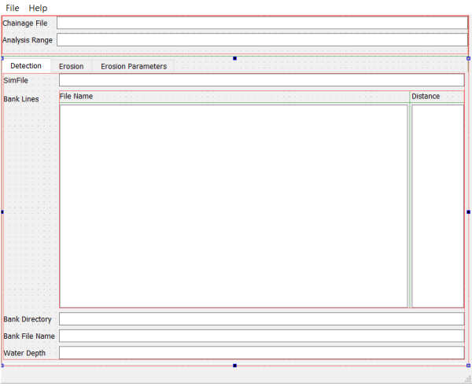
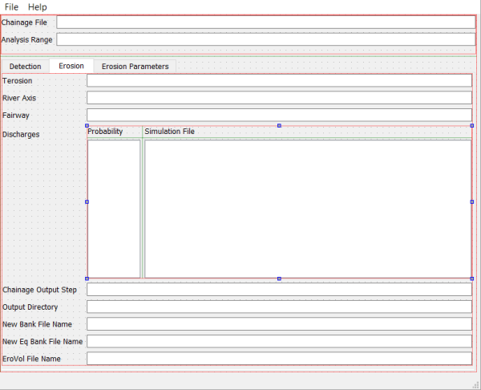
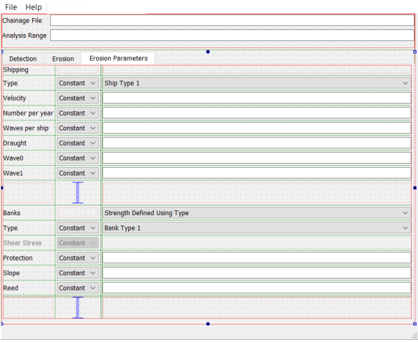

# Software Requirement

## Introduction

The new program is to replace WAQBANK which was developed for the SIMONA system.
The essence of the requirements is that the new code should be consistent with the WAQBANK version except for the fact that it supports new D-Flow FM map-files.

WAQBANK consists of two components:

1. the first component to determine the location of bank lines based on simulation results and a reference bank line (e.g.~from Baseline)
1. the second component to determine the bank erosion along that line based on simulatio results and user input.

The input of WAQBANK consists of one configuration using an ini-file like syntax which includes references to SIMONA or Delft3D 4 simulation files, and various simple ASCII files containing analysis parameters varying along the river reach.
The output of WAQBANK consists of a number of simple ASCII files reporting on the erosion volumes per reach segment (e.g.~per km) and a number of files listing the new coordinates of the bank lines after erosion.
Finally, the WAQBANK program may write some data in file formats suitable for visualization in WAQVIEW and generate a number of figures.

## Functional Requirements

1. The results of this program must match those of WAQBANK given the same input data.
1. Users must be able to run this program in batch mode from the command line.
1. Users must be able to run the analysis based on D-Flow FM results.
1. Users must be able to provide all data via an input file, similar to the ini-file like file of WAQBANK.
1. The input files must be consistent with those of WAQBANK, or aligned with open standards or the D-Flow FM modelling system.
1. The output files must be consistent with those of WAQBANK, or aligned with open standards or the D-Flow FM modelling system.

1. The should read relevant data directly from D-Flow FM map-files similarly to WAQBANK reading data directly from SIMONA and Delft3D 4 result files.

1. A simple graphical user interface could support users in process of creating the input file.

1. It would be nice if the software would be more generally applicable than just the Dutch rivers.
1. It would be nice if the software would be able to run besides English also in Dutch.

## Non-functional requirements

1. The performance of the tools must be similar to that of WAQBANK, i.e.~it must run within about an hour.
1. The software must be version controlled.
1. The software must have formal testing and support.
1. The software must run on Windows.
1. The software must be easy to distribute.
1. The software must have a user manual.
1. The software must have technical documentation.
1. The software must meet the conditions described in [Rijkswaterstaat Informatievoorziening Aansluitvoorwaarden](http://publicaties.minienm.nl/documenten/rijkswaterstaat-informatievoorziening-aansluitvoorwaarden-riva-2017).

1. The software should run on any common operating system.
1. The software should be available as open source.

# Code Design

## Introduction

The original WAQBANNK code was developed in MATLAB.
For D-FAST Bank Erosion we have selected Python because

* The Python environment is available for free contrary to MATLAB.
* Python is a popular coding language for software developers and domain specialists and users alike, and it's therefore easier for development cycle.
* The use of NumPy should enable use to code the algorithm with a similar performance as MATLAB.
* Python allows to create redistributable binaries that are similar or smaller in size than MATLAB (including the MATLAB Compiler Runtime environment).
* Python combines well with the open source nature of this software and other developments in the Delft3D / D-HYDRO environment.

The software uses a number of Python modules for specific functionality.
Most importantly the code builds on

* `netCDF4` for reading and writing netCDF files.
* `NumPy` for the numerical computations using arrays.
* `PyQt5` for the graphical user interface.
* `Shapely` for complex geometric operations (simpler geometric operations on large datasets may be coded more efficiently in NumPy).

The next two sections describe the file formats used by the software and the subdivision into modules.

## File formats

The software distinguishes 7 files:

* The *analysis configuration file* defines the settings that are relevant for the execution of the software, it will point to other data files for bulk data.
* The *line geometry files* specify the coordinates of a line.
* The *chainage file* defines the river chainage along a line.
* The *parameter files* define optional spatial variations in the analysis input parameters.
* The *simulation result files* define the spatial variations in the velocities and water depths as needed by the algorithm.
* The *eroded volume file* reports on the eroded volumes along the analyzed river reach per chainage bin.
* The *dialog text file* defines all strings to be used in the interaction with the users (GUI, report, or error messages).

Each file type is addressed separately in the following subsections.

### analysis configuration file

The analysis configuration file of WAQBANK looked a lot like an ini-file, but deviated slightly due to different comment style and missing chapter blocks.
D-FAST Bank Erosion still supports the old files, but it's recommended to upgrade them to the newer file format described here which conforms to the usual ini-file format.
The user interface reads old (and obviously new) files, but always writes new files.

The file must contain a `[General]` block with a keyword `Version` to indicate the version number of the file.
The initial version number will be `1.0`.

Details on the other keywords supported are given below.

| Block          | Keyword         | Description |
|----------------|-----------------|-------------|
| General        | Version         | Version number. Must be `1.0` |
|                | RiverKM         | Textfile with riverkilometres and correspondig xy-coordinates |
|                | Boundaries      | River chainage of the region of interest specified as rkm-start:rkm-end, e.g. 81:100 (default: all) |
| Detect         | SimFile         | Name of simulation output file to be used for determining representative bank line |
|                | NBank           | Number of bank lines, (default: 2) |
|                | Line _i_        | Textfile with xy-coordinates of search line _i_ |
|                | BankDir         | Directory for storing bank lines (default: current directory) |
|                | BankFile        | Text file(s) in which xy-coordinates of bank lines are stored (default 'bankfile') |
|                | LocalDir        | Directory for storing local output (default: 'local') |
|                | Waterdepth      | Water depth used for defining bank line (default: 0.0) |
|                | Dlines          | Distance from pre-defined lines used for determining bank lines (default: 50) |
| Erosion        | TErosion        | Simulation period  [years] |
|                | RiverAxis       | Textfile with xy-coordinates of river axis |
|                | Fairway         | Textfile with xy-coordinates of fairway axis |
|                | NLevel          | Number of discharge levels |
|                | RefLevel        | Reference level: discharge level with SimFile_i_ that is equal to 'SimFile' (only used when 'Nlevel'>1)  (default: 1) |
|                | SimFile _i_     | NetCDF map-file for computing bank erosion for discharge _i_ (only used when 'Nlevel'>1) |
|                | PDischarge _i_  | Probability of discharge _i_ (sum of probabilities should be 1) |
|                | OutputDir       | Directory for storing output files |
|                | BankNew         | Text file(s) in which new xy-coordinates of bank lines are stored (default 'banknew') |
|                | BankEq          | Text file(s) in which xy-coordinates of equilibrium bank lines are stored (default: 'bankeq') |
|                | EroVol          | Text file in which eroded volume per river-km is stored (default: 'erovol.evo') |
|                | OutputInterval  | Bin size for which the eroded volume output is given (default: 1 km) [km] |
|                | ShipType        | Type of ship (per river-km) |
|                | Vship           | Relative velocity of the ships (per river-km) [m/s] |
|                | Nship           | Number of ships per year (per river-km) |
|                | Nwave           | Number of waves per ship (default 5) |
|                | Draught         | Draught of the ships (per river-km) [m] |
|                | Wave0           | Distance from fairway axis at which waveheight is zero (default 200 m) |
|                | Wave1           | Distance from fairway axis at which reduction of waveheigth to zero starts (default Wave0-50 m) |
|                | Classes         | Use classes (true) or critical shear stress (false) in 'BankType' (default: true) |
|                | BankType        | Bank strength definition (for each bank line per river-km) |
|                | ProtectionLevel | Text file(s) with level of bank protection for each bank line per river-km (default: -1000) |
|                | Slope           | Text file(s) with equilibrium slope for each bank line per river-km  (default: 20) |
|                | Reed            | Text file(s) with reed wave damping coefficient for each bank line per river-km  (default: 0) |
|                | VelFilter       | Filtering velocity along bank lines (default: true) |

**Example**

    [General]
      Version         = 1.0
      RiverKM         = inputfiles\rivkm_20m.xyc
      Boundaries      = 68:230

    [Detect]
      SimFile         = inputfiles\SDS-krw3_00-q0075_map.nc
      NBank           = 2
      Line1           = inputfiles\oeverlijn_links_mod.xyc
      Line2           = inputfiles\oeverlijn_rechts_mod.xyc
      BankDir         = files\outputbanklines
      BankFile        = bankline
      LocalDir        = local
      Waterdepth      = 0.0
      Dlines          = [20,20]

    [Erosion]
      Terosion        = 1
      RiverAxis       = inputfiles\maas_rivieras_mod.xyc
      Fairway         = inputfiles\maas_rivieras_mod.xyc
      NLevel          = 2
      RefLevel        = 1
      SimFile1        = inputfiles\SDS-krw3_00-q0075_map.nc
      PDischarge1     = 0.25
      SimFile2        = inputfiles\SDS-krw3_00-q1500_map.nc
      PDischarge2     = 0.75
      OutputDir       = files\outputbankerosion
      BankNew         = banknew
      BankEq          = bankeq
      EroVol          = erovol_standard.evo
      OutputInterval  = 0.1
      ShipType        = 2
      Vship           = 5.0
      Nship           = inputfiles\nships_totaal
      Nwave           = 5
      Draught         = 1.2
      Wave0           = 150.0
      Wave1           = 110.0
      Classes         = false
      BankType        = inputfiles\bankstrength_tauc
      ProtectionLevel = inputfiles\stortsteen

### line geometry files

This file specifies the coordinates of a single line.
It is used to specify

1. RiverAxis
1. Fairway
1. Original or moved bank lines

The file format is equal to the file format used by WAQBANK.
It consists of two data columns: the first column specifies the x-coordinate and the second column the y-coordinate of each node of the line.

**Example**

    1.1887425781300000e+005  4.1442128125000000e+005
    1.1888840213863159e+005  4.1442400328947371e+005
    1.1890254646426316e+005  4.1442672532894736e+005
    1.1891669078989474e+005  4.1442944736842107e+005
    1.1893083511552632e+005  4.1443216940789472e+005
    1.1894497944115789e+005  4.1443489144736843e+005
    1.1895912376678947e+005  4.1443761348684208e+005
    1.1897326809242106e+005  4.1444033552631579e+005
    1.1898741241805263e+005  4.1444305756578950e+005

    ...continued...

### chainage file

This file defines the river chainage along a line.
The file format is equal to the file format used by WAQBANK.
It consists of three data columns: the first column specifies the chainage, the second and third columns specify the x- and y-coordinates of each node of the line.

**Eample**

    3     175908.078100	   308044.062500
    6     176913.890600      310727.781300
    10     176886.578100     314661.750000
    15     176927.328100     319589.687500
    16     176357.000000     320335.375000

    ...continued...

### parameter files

These files may be used to define spatial variations in the input parameters needed by the analysis.
Many parameters may be varied along the analyzed river reach.

1. wave0
1. wave1
1. vship
1. nship
1. nwave
1. draught
1. shiptype
1. slope
1. reed
1. banktype
1. protectionlevel

The file format is independent of the parameter for which it's used.
The file format is equal to the file format used by WAQBANK.
It consists of two data columns: the first column specifies the chainage and the second column the value at that location.

**Example**

    65.3    20912
    67.6    18529
    100.7   20375
    146.8   24758
    175.5   13911
    201     15613

### simulation result files

For the bank line detection and bank erosion analysis, the program  needs results from a hydrodynamic model.
The WAQBANK program was able to read data from the WAQUA SDS-output files or the Delft3D-FLOW trim-files.
D-FAST Bank Erosion now supports the results of D-Flow FM in netCDF map-files following UGRID conventions.
The model needs the following data fields:

1. x-coordinates of the mesh nodes
1. y-coordinates of the mesh nodes
1. face_node_connectivity of the mesh
1. bed levels zb at the mesh nodes
1. water levels zw at the mesh faces
1. water depths h at the mesh faces
1. velocity vector (ucx,ucy) at the mesh faces

The simulation result files may contain multiple time steps; the final time steps will be used for the analysis.

### eroded volume file

This file reports on the eroded volumes per bank along the analyzed river reach per user defined chainage bin.
The file consists _1+N_ tab-separated data columns where _N_ is the number of bank lines processed: the first column specifies the chainage and the other columns report on the eroded bank volume per bank line accumulated be chainage bin.
The chainage coordinate provided is the upper limit of the chainage bin for which the volume is reported on that line.
The file format differs slightly from the file format used by WAQBANK since that file contained _N_ identical chainage columns followed by the _N_ eroded volume columns.

**Example**

    68.00   2.21    0.00
    68.10   6.44    0.00
    68.20   7.81    0.00
    68.30   43.63   161.39
    68.40   14.24   0.00
    68.50   8.88    0.00
    68.60   0.00    0.00
    68.70   0.00    0.00
    68.80   2.39    0.00
    68.90   0.00    0.00
    69.00   0.88    0.00
    69.10   7.40    69.27
    69.20   5.64    65.47
    69.30   11.98   55.78

    ...continued...

### dialog text file

The dialog text file uses the block labels enclosed by square brackets of the common ini-file format, but the lines in between the blocks are treated verbatim and don't list keyword/value pairs.
Every print statement in the program is associated with a short descriptive identifier.
These identifiers show up in the dialog text file as the block labels.
The text that follows the block label will be used at that location in the program.
The order of the blocks in the file is not important.
Please note that every line is used as is, so don't add indentations or blank lines unless you want those to show up during the program execution.
Most blocks may contain any number of lines, but some blocks may only contain a single line.
Some data blocks may contain one or more Python-style placeholders used for inserting values.

**Example**

The following excerpt of the default `messages.UK.cfg` dialog text file shows the string definition for 5 identifiers, namely '' (the identifier for an empty line), 'header', 'confirm', 'confirm_or' and 'confirm_or_restart'.
The header string contains one placeholder, namely `{version}` for the the version number.

    []

    [header_banklines]
    =====================================================
    Determine bank lines
    =====================================================
    version: {version}
    source: {location}
    -----------------------------------------------------
    [end_banklines]

    =====================================================
    ===        BankLines ended successfully!          ===
    =====================================================
    ... continued ...

## Listing of Modules

D-FAST Bank Erosion is subdivided into 5 modules:

* `dfastbe_io` for all file handling: reading of input and configuration files as well as writing of results files.
* `dfastbe_kernel` for all scientific steps of the algorithm.
* `dfastbe_support` for various (mostly geometric) steps of the algorithm.
* `dfastbe_cli` for the command line interface (batch mode).
* `dfastbe_gui` for the graphical user interface.

Each component is addressed separately in the subsections after the file descriptions.

### input/output module `dfastbe_io`

The `dfastbe_io` module contains all file handling routines for reading configuration files, processing netCDF input and output files, and functions to support various input and output formats.

This module contains the following routines:

* `read_program_texts` fills a dictionary of dialog texts by reading the dialog text configuration file.
* `read_xyc` read line geometry files and chainage file.
* `write_km_eroded_volumes` writes an eroded volume file.

* `read_config` reads an analysis configuration file -- this routine just reads the file, it does not perform any checking of the parameters.
* `write_config` support function to write a nicely formatted analysis configuration file.
* `config_get_str`, `config_get_float`, `config_get_int`, `config_get_bool` get string, float, integer and boolean value from the analysis configuration file.
* `config_get_simfile` get simulation file name from the analysis configuration file.
* `config_get_range` get a range (as minimum and maximum value) from the analysis configuration file.
* `config_get_parameter` get a parameter value per bank node (either by expanding a constant value or by reading one or more parameter files).
* `config_get_xykm` get chainage line and clip it to the range of interest (includes supporting routine `clip_chainage_path` for clipping).
* `config_get_bank_guidelines` get _N_ guidelines for the bank locations.

* `read_simdata` for reading all relevant data from the D-Flow FM map-file.
* `read_fm_map` for reading single data fields from the D-Flow FM map-file.
* `copy_ugrid` for copying UGRID mesh information from the D-Flow FM map-file to the spatial output file.
* `copy_var` support function for copying an individual netCDF variable from netCDF file to another.
* `ugrid_add` support function for adding a variable to a netCDF UGRID file with appropriate meta data.

### core algorithm `dfastbe_kernel`

The `dfastbe_kernel` module contains all routines for that perform the mathematical processing steps of the algorithm.
This module also contains the main version number.

This module contains the following routines:

* `program_version` returns the version string of the current algorithm.
* `comp_erosion_eq` computes the equilibrium erosion distance per bank line segment given the reference flow conditions.
* `comp_erosion` computes the erosion distance per bank line segment given a single flow condition.
* `edge_mean` averages the parameter values from the bank line nodes to the bank line segments.
* `comp_hw_ship_at_bank` compute the ship induced wave height at the beginning of the fore shore.
* `get_km_bins` expand the chainage range and step size to a list of chainage bin boundary values.
* `get_km_eroded_volume` accumulate the eroded volumes per chainage bin.

### (geometric) support routines `dfastbe_support`

The `dfastbe_support` module contains all routines that are not related to IO or core algorithm formulations.
Most of these routines include geometric processing.

This module contains the following routines:

* `project_km_on_line` transfer the chainage information from the chainage line to another line.
* `intersect_line_mesh` intersect a line with a mesh to arrive at line segments uniquely linked to mesh faces.
* `map_line_mesh` determine for each node of a line in which cell (face) of the mesh it's located.
* `move_line` shift a bank line based on the estimated bank erosion distances.
* `convert_guide_lines_to_bank_polygons` create bank polygons around bank guide lines at user specified distance.
* `clip_simdata` clip simulation data to region within a specified distance from a line.
* `get_banklines` detect all possible bank line segments based on simulation data.
* `poly_to_line` determine bank line for a face of arbitrary (convex) polygonal shape.
* `tri_to_line` determine bank line for a face of triangular shape.
* `clip_sort_connect_bank_lines` clip detected bank line segments to within bank polygons and connect segments to continuous bank lines.

### command line interface `dfastbe_cli`

This module implements the command line version of D-FAST Bank Erosion.
Depending on the command line arguments it will run in either one of two modes:

1. Bank line detection mode ('banklines').
This is the first step of the algorithm that detects the location of the banks based on a representative D-Flow FM simulation and an initial hint regarding the banks of interest.
2. Bank erosion estimation mode ('bankerosion').
This is the second step of the algorithm which uses the bank location and various D-Flow FM simulation results as input and estimates the bank erosion rates and volumes and indicates the resulting retreated bank lines.

The following command line options are supported

| short | long             | description                                  |
|-------|:-----------------|:---------------------------------------------|
| -h    | --help           | show help text and exit                      |
| -l    | --language       | name of dialog text file                     |
| -m    | --mode           | 'banklines' or 'bankerosion'                 |
| -i    | --input_file     | name of analysis configuration file          |

This module contains the following routines:

* `banklines` implements the first part of the algorithm, namely the bank line detection
* `bankerosion` implements the second part of the algorithm, namely the bank erosion estimation
* `log_text` print the selected text to screen or report
* `timedlogger` prints selected text to screen with timing information
* `timer` tracks time and prints timing information
* `get_program_text` selects the appropriate text from the dictionary of dialog texts (see `read_program_texts`)
* `parse_arguments` parses the command line arguments and decide on batch mode or legacy interactive mode

### graphical user interface `dfastbe_gui`

This module implements the graphical user interface version of D-FAST Bank Erosion.
It can be used to generate and edit the analysis configuration files for both the bank line detection and bank erosion steps.
The following command line options are supported

| short | long             | description                                  |
|-------|:-----------------|:---------------------------------------------|
| -h    | --help           | show help text and exit                      |
| -l    | --language       | name of dialog text file                     |
| -i    | --input_file     | name of initial analysis configuration file  |

This module contains the following routines:

* `create_dialog` to create the graphical user interface
* `activate_dialog` to hand over control to the user interface
* `close_dialog` support function to close the dialog and end the program
* `file_selector` support function to create a dialog entries of a text field with a browse for file option for all simulation result files options
* `select_file` callback function to browse for a simulation result file and update the associated dialog entry
* `load_configuration` and `save_configuration` callback functions to trigger reading and writing analysis configuration files
* `menu_about_self` and `menu_about_qt` callback functions to show About boxes
* `show_error` support function to show an error dialog

Further callback functions will be added as needed.

# Software Maintenance

Currently we are at the stage of prototyping, but the end goal of the project is to deliver a formal maintained product.
This means that we will be following a set of best practices for software maintenance to assure the quality of the product.

## Coding Guidelines

This program is implemented following PEP 8 style guide using Python 3.x.
We'll be using type hinting and brief documentation of the functions to guide future developers with respect to the purpose of the various functions, input and output variables.
Additional restrictions on coding style may be applied, such as Black Code Formatter.
As the code matures from prototype to beta product and final release product, we'll be implementing increasingly formal code reviews.

## Version Control

GitHub is currently used for software version control.
The repository is located at https://github.com/Deltares/D-FAST_Bank_Erosion.
We may switch to GitLab in line with RIVA (2020) (see http://publicaties.minienm.nl/documenten/rijkswaterstaat-informatievoorziening-aansluitvoorwaarden-riva-2017).
We'll be creating release branches and development branches to keep the trunk and releases stable.

## Automated Building and Testing of Code

Automated TeamCity projects will be set up within Deltares for testing the Python code, for building (and optionally signing of) binaries, and testing of the binaries.
In this way the formal release process can be easily aligned with the other products.
It is yet to be determined what the best location is for the potentially large binary model simulation files needed for the test bench.

During the development the following types of tests will be carried out.

1. Unit testing at the level of functions, such as reading and writing of files, and basic testing of the algorithms.
1. Convert one or two sets of legacy input files (SIMONA and/or Delft3D 4) to D-Flow FM like netCDF files.
Running D-FAST Bank Erosion on those converted files should give results that are very similar to those obtained from a WAQBANK run on the original files.
1. Run D-Flow FM simulations using the same curvilinear mesh as was used in WAQUA/Delft3D 4.
Running D-FAST Bank Erosion on the new files will give different results than those obtained from the WAQUA/Delft3D 4 results since a different hydrodynamic solver was used, but the differences are expected to be small.
They will be quantified and reported.
1. Run D-Flow FM simulations using a new unstructured mesh.
Running D-FAST Bank Erosion on those new unstructured model results will give different results than those obtained using the curvilinear model, but the differences are expected to be small.
They will be quantified and reported.

For the automated testing, unit tests and regression tests based on known input/output combinations will be used.
These tests will be executed on the original Python code and to the degree possible on the compiled binaries as well.
Details of the various tests implemented will be documented as the project progresses and full documentation will be included in the final project documentation.

## Automated Generation of Documentation

An automated environment for generation of the user manual will be set up.
This will be integrated in the daily cycle of building all manuals on Deltares TeamCity server.
The documentation written in a combination of LaTeX and markdown files is maintained in the GitHub repository alongside the source code.
